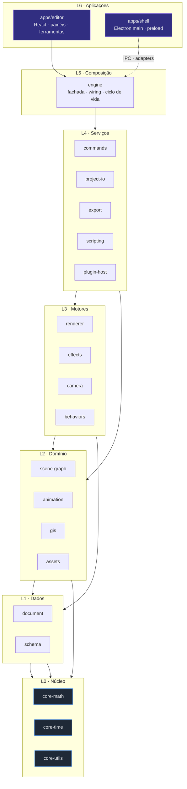
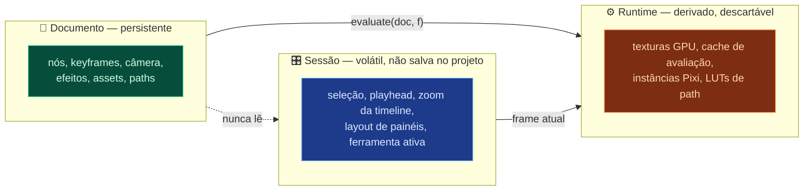
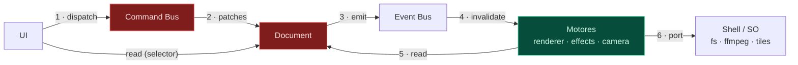
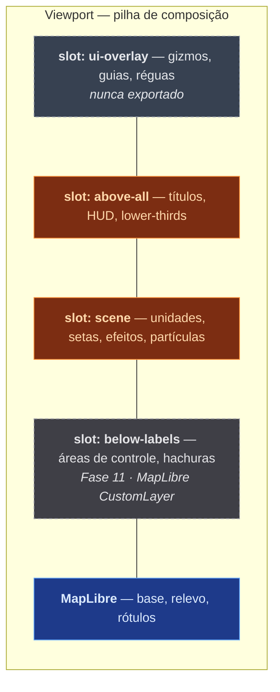
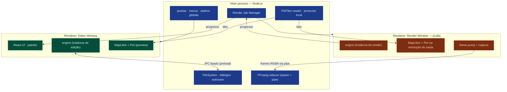

# 01 — Arquitetura

## 1. Forma geral

Arquitetura em **camadas com dependência unidirecional** (onion / ports & adapters).

O centro é matemática pura e o modelo de dados. Nada no centro sabe que existe
React, Electron, MapLibre ou GPU. As bordas — UI e sistema operacional — sabem
de tudo, mas ninguém depende delas.



**Regra dura:** um pacote nunca importa de uma camada superior. Dentro de uma
mesma camada conceitual, somente as arestas dirigidas da
[matriz normativa](02-MODULES.md#matriz-de-dependências) são aceitas. Por
exemplo, `effects → renderer` existe; `renderer → effects` não. Qualquer outra
comunicação lateral acontece pelo Event Bus ou pela camada de composição (L5).
ESLint verifica cada import e `dependency-cruiser` verifica o grafo inteiro em
`pnpm lint:arch`.

Isso preserva a utilidade das camadas sem fingir que módulos do mesmo nível
nunca se compõem. A direção explícita torna cada camada um DAG: ciclos como
`camera → renderer → camera` continuam impossíveis e quebram o build.

---

## 2. Os três estados do sistema

A confusão mais comum em editores é misturar estado. Aqui existem exatamente três
tipos, com regras diferentes:



|                     | Documento                 | Sessão                          | Runtime      |
| ------------------- | ------------------------- | ------------------------------- | ------------ |
| Onde vive           | `document` store          | Zustand + workspace em userData | motores      |
| Serializável        | **sim, obrigatoriamente** | parcialmente, fora do projeto   | não          |
| Como muta           | só via Command Bus        | `set()` direto                  | reconstruído |
| Undo                | sim                       | não                             | n/a          |
| Vai pro `.theatrum` | sim                       | não                             | não          |

O arranjo dos painéis é uma preferência global do operador e vive em
`app.getPath("userData")/workspace.json`, com escrita atômica. Assim trocar de
projeto não desmonta o ambiente de trabalho e metadados de sessão nunca alteram
o ZIP determinístico. Playhead, seleção, ferramenta ativa e zoom da timeline
permanecem voláteis.

**Invariantes:**

- O Documento nunca contém referência a objeto de runtime (nada de `THREE.Texture`,
  `PIXI.Sprite`, `HTMLImageElement`). Só IDs e valores primitivos.
- O Runtime nunca é fonte de verdade. Perder tudo e reconstruir do Documento deve
  produzir estado idêntico.
- A Sessão nunca influencia o resultado renderizado, **exceto** pelo frame atual e
  por _overlays de edição_ (gizmos, guias, seleção) que não entram no export.

Essa última é o que garante que preview e export batam. Se a seleção mudasse a
imagem, exportar daria resultado diferente do que se vê.

---

## 3. Fluxo de uma edição

Todo caminho de mutação é o mesmo, venha de onde vier: clique, atalho, plugin,
importação de IA.

```mermaid
sequenceDiagram
    autonumber
    participant U as UI / Plugin / Scene&nbsp;Script
    participant B as Command&nbsp;Bus
    participant H as Handler
    participant D as Document&nbsp;Store
    participant Hi as History
    participant E as Event&nbsp;Bus
    participant R as Renderer

    U->>B: dispatch(SetKeyframe{node, prop, frame, value})
    B->>B: valida payload (Zod)
    B->>H: resolve handler por type
    H->>D: produce(draft => mutate(draft))
    D-->>H: patches[] + inversePatches[]
    H->>Hi: push({patches, inverse, label})
    D->>E: emit("document:changed", patches)
    E->>R: invalidate(scope derivado dos patches)
    R->>R: re-avalia só o necessário
    Note over R: próximo frame reflete a mudança
```

Pontos que importam:

- **Passo 2 — validação.** Comandos são validados por schema Zod. Um plugin ou um
  JSON de IA malformado é rejeitado com erro legível, não corrompe o documento.
- **Passo 5 — patches.** Immer devolve JSON Patch e o patch inverso de graça. O
  inverso é o undo. Não existe "snapshot do documento inteiro" no histórico.
- **Passo 8 — invalidação dirigida por patch.** O caminho do patch
  (`/compositions/cmp_main/nodes/nd_tank_1/transform/position`) diz exatamente o
  que sujou. O renderer invalida esse nó, não a cena.

**Transações.** Arrastar um objeto emite ~60 comandos por segundo. Sem
agrupamento, o histórico viraria lixo. `bus.transaction(label, fn)` colapsa tudo
em uma entrada única de undo e emite um evento de mudança só no final.

---

## 4. Ciclo de um frame

Aqui está o coração do sistema. Este pipeline roda igual em preview e em export;
a única diferença são os passos marcados **[export]**.

```mermaid
flowchart TD
    START(["frame f"]) --> EV

    subgraph PURO["Puro · sem GPU · testável isoladamente"]
        EV["<b>1. Evaluate</b><br/>animation.evaluate(doc, f)"]
        EV --> EV1["1a. resolve timeRange e timeRemap"]
        EV1 --> EV2["1b. keyframes → valores"]
        EV2 --> EV3["1c. expande Actions (modo live)"]
        EV3 --> EV4["1d. aplica Behaviors<br/>(motion path → posição + bearing)"]
        EV4 --> EV5["1e. matrizes locais + hierarquia"]
        EV5 --> ES["EvaluatedScene<br/><i>espaços geo e comp ainda não resolvidos</i>"]
    end

    ES --> CAM["<b>2. Camera.apply</b><br/>map.jumpTo(center, zoom, bearing, pitch)"]
    CAM --> SETTLE{{"<b>3. MapSettle</b> [export]<br/>idle + glyphs + sprites + terreno"}}
    SETTLE --> PROJ["<b>4. Projector snapshot</b><br/>congela o transform do MapLibre"]

    subgraph LAYOUT["Layout · geo → pixel"]
        PROJ --> L1["5a. anchor geo → tela (via Projector)"]
        L1 --> L2["5b. size ground(m) → px (metersPerPixel)"]
        L2 --> L3["5c. rotation geo-bearing → ângulo de tela"]
        L3 --> SS["ScreenScene<br/><i>tudo em pixels</i>"]
    end

    SS --> REN["<b>6. Renderer</b><br/>passes por z-slot"]
    REN --> FX["<b>7. Effects</b><br/>filtros + partículas (uniform: f)"]
    FX --> COMP["<b>8. Compositor</b><br/>canvas do mapa + slots de overlay"]
    COMP --> OUT{"modo?"}
    OUT -->|preview| SCREEN(["tela"])
    OUT -->|export| CAP["<b>9. Capture</b> → Encoder.write(f)"]

    classDef pure fill:#064e3b,stroke:#34d399,color:#d1fae5
    classDef gpu fill:#7c2d12,stroke:#fb923c,color:#fed7aa
    classDef gate fill:#78350f,stroke:#fbbf24,color:#fef3c7
    class EV,EV1,EV2,EV3,EV4,EV5,ES pure
    class REN,FX,COMP,CAP gpu
    class SETTLE gate
```



A ordem dos passos 2 → 4 → 5 é **obrigatória** e não óbvia:

> A câmera é aplicada ao mapa **antes** do layout, e o layout usa a projeção
> **do próprio mapa**.

Se invertêssemos — calculando posições de tela com nossa própria matriz de
projeção — o overlay derivaria do mapa em pitch alto, perto dos polos e sobre
terreno 3D. Alinhamento sub-pixel entre um tanque e a estrada abaixo dele é
requisito, não detalhe.

Detalhamento completo, incluindo o problema do _settle_ e a captura em 8K:
[06-RENDER-PIPELINE.md](06-RENDER-PIPELINE.md).

---

## 5. Comunicação entre módulos

Quatro mecanismos, cada um com uso definido. Nada além destes quatro.

### 5.1 Import direto (descendo camadas)

O caso normal. `animation` importa `core-math`. Chamada de função, tipada, síncrona.
Só através do barrel público (`packages/animation/src/index.ts`), nunca de arquivo
interno.

### 5.2 Ports & Adapters (para fora do processo)

Motores declaram **interfaces** (`*.port.ts`); o shell Electron fornece as
implementações. É assim que `export` grava arquivo sem saber que existe `fs`.

```ts
// packages/export/src/ports/encoder.port.ts
export interface EncoderPort {
  readonly capabilities: EncoderCapabilities;
  open(spec: OutputSpec): Promise<void>;
  write(frame: CapturedFrame): Promise<void>;
  close(): Promise<EncodeResult>;
  abort(reason: string): Promise<void>;
}
```

Ports definidos no projeto:

| Port             | Implementação real                      | Implementação de teste          |
| ---------------- | --------------------------------------- | ------------------------------- |
| `FileSystemPort` | IPC → `fs` no main                      | `MemoryFileSystem`              |
| `EncoderPort`    | `WebCodecsEncoder`, `FFmpegPipeEncoder` | `NullEncoder` (conta frames)    |
| `TileSourcePort` | `PMTilesSource`, `HttpTileSource`       | `FixtureTileSource`             |
| `ProjectorPort`  | `MapLibreProjector`                     | `MercatorProjector` (analítico) |
| `ClockPort`      | `RealtimeClock`                         | `ManualClock`                   |
| `GazetteerPort`  | `NaturalEarthGazetteer`                 | `StubGazetteer`                 |

`ClockPort` existe por causa do determinismo: nenhum módulo chama
`performance.now()` diretamente. Em export o clock é o próprio contador de frames.

### 5.3 Command Bus (mutação)

Único caminho de escrita no Documento. Já descrito na § 3.

```ts
interface CommandBus {
  dispatch<T extends CommandType>(cmd: Command<T>): CommandResult;
  transaction(label: string, fn: () => void): CommandResult;
  register<T>(type: T, handler: CommandHandler<T>): Disposable;
  undo(): void;
  redo(): void;
}
```

Registro aberto: plugins registram comandos novos pelo mesmo mecanismo dos
comandos nativos. Não existe caminho privilegiado.

### 5.4 Event Bus (notificação)

Tipado, síncrono, sem payload mutável. Para avisar _lateralmente_ sem criar
dependência.

```ts
type AppEvents = {
  "document:changed": { patches: Patch[]; source: CommandSource };
  "document:loaded": { projectId: string };
  "selection:changed": { nodeIds: string[] };
  "playhead:moved": { frame: number; scrubbing: boolean };
  "composition:active": { compositionId: string };
  "map:idle": { generation: number };
  "assets:registered": { assetIds: string[] };
  "render:progress": { jobId: string; frame: number; total: number };
  "plugin:loaded": { pluginId: string };
};
```

**Proibido:** usar o Event Bus para mutar documento (use comandos), para pedir
dados (use import direto), ou como fila assíncrona (use `TaskQueue` no `engine`).

### Resumo em diagrama



Uma flecha que **não existe** e nunca deve existir: motor → UI. Nenhum módulo
abaixo de L6 conhece React.

---

## 6. Composição no processo do renderer

Como as coisas se sobrepõem na tela. Esta é a parte de maior risco técnico do
projeto, e a decisão está registrada em [ADR-002](adr/ADR-002-compositor.md).



Cada slot é um alvo de render independente. O `Compositor` esconde **como** cada
slot é implementado:

- `scene` e `above-all`: canvas Pixi empilhado por CSS sobre o canvas do mapa.
- `below-labels`: exige compartilhar o contexto WebGL com o MapLibre — bem mais
  difícil. Fica para a Fase 11, atrás da mesma interface, e o produto é
  plenamente utilizável sem ele.
- `ui-overlay`: canvas separado, excluído do export por construção (o export
  monta a pilha sem esse slot).

O ganho de desenhar a interface de edição em um slot que o export desconhece:
impossível vazar um gizmo pro vídeo final. É uma garantia estrutural, não uma
checagem.

---

## 7. Processos (Electron)



A **Render Window** separada resolve três problemas de uma vez:

1. A UI não congela durante um export de 40 minutos.
2. O canvas de render tem a resolução de saída (3840×2160), não o tamanho do
   viewport visível. Sem isso, exportar em 4K de um viewport de 900 px exigiria
   redimensionar a janela do usuário.
3. Isolamento de contexto GPU: um crash de driver durante o export não leva o
   editor com o projeto não salvo.

`nodeIntegration` fica desligado nas duas janelas. Todo acesso a Node passa por
`contextBridge` com superfície explícita e tipada em `apps/shell/src/ipc/`.

---

## 8. Padrões adotados

| Padrão                      | Onde                                           | Motivo                                           |
| --------------------------- | ---------------------------------------------- | ------------------------------------------------ |
| Layered / Onion             | pacotes                                        | Testabilidade; núcleo sem dependência            |
| Ports & Adapters            | motores ↔ SO                                   | Trocar Electron sem tocar em motor               |
| Command + Memento (patches) | mutação e undo                                 | Undo barato; auditável; um só caminho de escrita |
| Registry                    | tipos de nó, efeitos, ações, exporters, verbos | Extensão sem editar `switch`                     |
| Pure function evaluator     | `animation`                                    | Pré-requisito do determinismo                    |
| Structure of Arrays         | partículas, keyframes densos                   | Cache-friendly; upload direto pra GPU            |
| Flat map + `children[]`     | scene graph                                    | Patch estável, reparent O(1)                     |
| Facade                      | `engine`                                       | UI depende de 1 pacote, não de 18                |
| Object pool                 | frames capturados, buffers                     | Zero GC durante export                           |
| Content addressing          | assets no `.theatrum`                          | Dedup automático, diff barato                    |

### Anti-padrões proibidos

- Singleton global mutável. Tudo recebe dependências no construtor/factory.
  Duas instâncias do `engine` (editor + render) precisam coexistir no mesmo app.
- `any` implícito ou explícito fora de fronteira de I/O bruta.
- Ler o Documento dentro de `render()` de componente React sem selector.
- Estado do editor influenciando o pixel exportado.
- `switch (node.type)` fora de um registry.

---

## 9. Estrutura de pastas

```
theatrum/
├─ apps/
│  ├─ editor/                    # renderer process — React
│  │  ├─ src/
│  │  │  ├─ app/                 # bootstrap, providers, workspace, atalhos
│  │  │  ├─ panels/              # 1 pasta por painel dockável
│  │  │  │  ├─ viewport/
│  │  │  │  ├─ timeline/
│  │  │  │  ├─ graph-editor/
│  │  │  │  ├─ inspector/
│  │  │  │  ├─ project/
│  │  │  │  ├─ library/
│  │  │  │  ├─ effects/
│  │  │  │  └─ render-queue/
│  │  │  ├─ interactions/        # ferramentas: select, pen, path, camera, gizmos
│  │  │  ├─ widgets/             # compostos reutilizáveis (KeyframeTrack, CurveCanvas)
│  │  │  ├─ ui/                  # primitivos do design system (Button, Field, Panel)
│  │  │  ├─ stores/              # zustand: selection, playhead, viewport, layout
│  │  │  ├─ bridge/              # cliente IPC tipado
│  │  │  └─ styles/
│  │  └─ index.html
│  └─ shell/                     # Electron
│     └─ src/{main,preload,ipc}/
├─ packages/
│  ├─ core-math/    core-time/    core-utils/          # L0
│  ├─ schema/       document/                          # L1
│  ├─ scene-graph/  animation/    gis/     assets/     # L2
│  ├─ renderer/     effects/      camera/  behaviors/  # L3
│  ├─ commands/     project-io/   export/              # L4
│  ├─ scripting/    plugin-host/                       # L4
│  └─ engine/                                          # L5
├─ plugins/                       # plugins locais
├─ data/                          # geodados offline
│  ├─ basemap/*.pmtiles
│  ├─ glyphs/    sprites/    styles/    gazetteer/
├─ assets/                        # biblioteca de unidades (SVG, sprite sheets)
├─ tools/                         # scripts: gen-schema, prep-tiles, build-atlas
├─ tests/
│  ├─ e2e/                        # Playwright + Electron
│  └─ golden/                     # fixtures + frames de referência
└─ docs/
```

Convenções de arquivo e nomenclatura: [07-CONVENTIONS.md](07-CONVENTIONS.md).

---

## 10. Riscos técnicos conhecidos

Registrados agora para não serem descobertos na Fase 8.

| #   | Risco                                                       | Impacto                    | Mitigação                                                                                                              |
| --- | ----------------------------------------------------------- | -------------------------- | ---------------------------------------------------------------------------------------------------------------------- |
| R1  | _Settle_ do mapa não converge em algum frame (tile ausente) | Frame corrompido no export | Timeout com falha fechada por padrão; continuação só quando explicitamente pedida. Diagnóstico por frame.              |
| R2  | Slot `below-labels` exige contexto WebGL compartilhado      | Feature adiada             | Isolado atrás do `Compositor`; produto completo sem ele (Fase 11)                                                      |
| R3  | `readPixels` sincroniza a GPU e domina o tempo de export    | Export lento               | Pool de PBO / `OffscreenCanvas`; preferir WebCodecs (`VideoFrame` do canvas, sem readback)                             |
| R4  | Limite de canvas/textura em 8K                              | Export 8K falha            | Teto direto de 8192 px e guarda da superfície real; tiles ficam como alternativa futura, sujeitos a costuras de rótulo |
| R5  | Alpha channel + mapa são incompatíveis                      | Confusão de usuário        | Modo `matte` explícito: alpha desativa a base e exporta só overlays                                                    |
| R6  | WebCodecs sem alpha confiável                               | Formatos limitados         | ProRes 4444 e PNG sequence via FFmpeg para alpha                                                                       |
| R7  | Determinismo quebra por descuido (`Math.random()`)          | Export não reproduzível    | Regra ESLint custom `no-nondeterminism` + teste de golden frame no CI local                                            |
| R8  | Terreno 3D altera projeção e desalinha overlay              | Objetos flutuando          | `Projector` consulta elevação do MapLibre; `altitude` explícito no anchor                                              |

---

## 11. ADRs

Decisões com alternativas avaliadas e consequências registradas:

- [ADR-001 — Electron em vez de Tauri](adr/ADR-001-shell-electron.md)
- [ADR-002 — Estratégia de composição mapa + overlay](adr/ADR-002-compositor.md)
- [ADR-003 — Determinismo como invariante do motor](adr/ADR-003-determinism.md)
- [ADR-004 — Frame inteiro como unidade canônica de tempo](adr/ADR-004-time-in-frames.md)
- [ADR-005 — Timeline e graph editor em canvas](adr/ADR-005-canvas-timeline.md)
- [ADR-006 — MapLibre + PMTiles como base geográfica](adr/ADR-006-maplibre.md)
- [ADR-007 — Nenhum Rust por enquanto](adr/ADR-007-no-rust-yet.md)
- [ADR-008 — Mapa plano de nós em vez de árvore aninhada](adr/ADR-008-flat-node-map.md)
