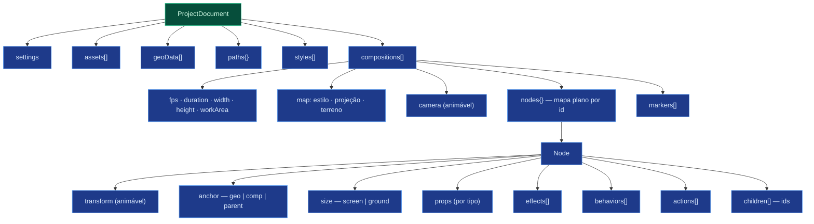
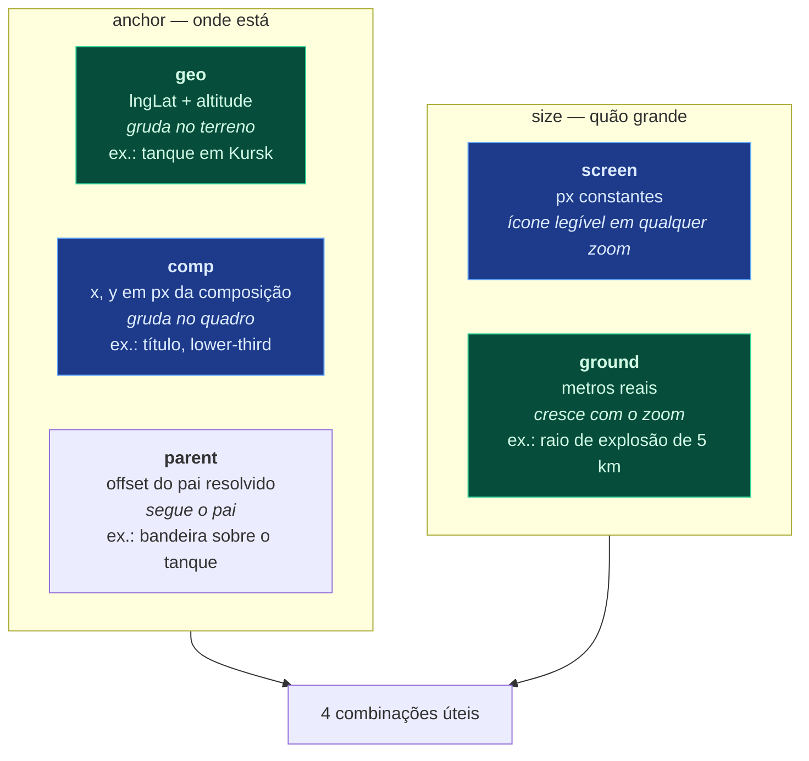
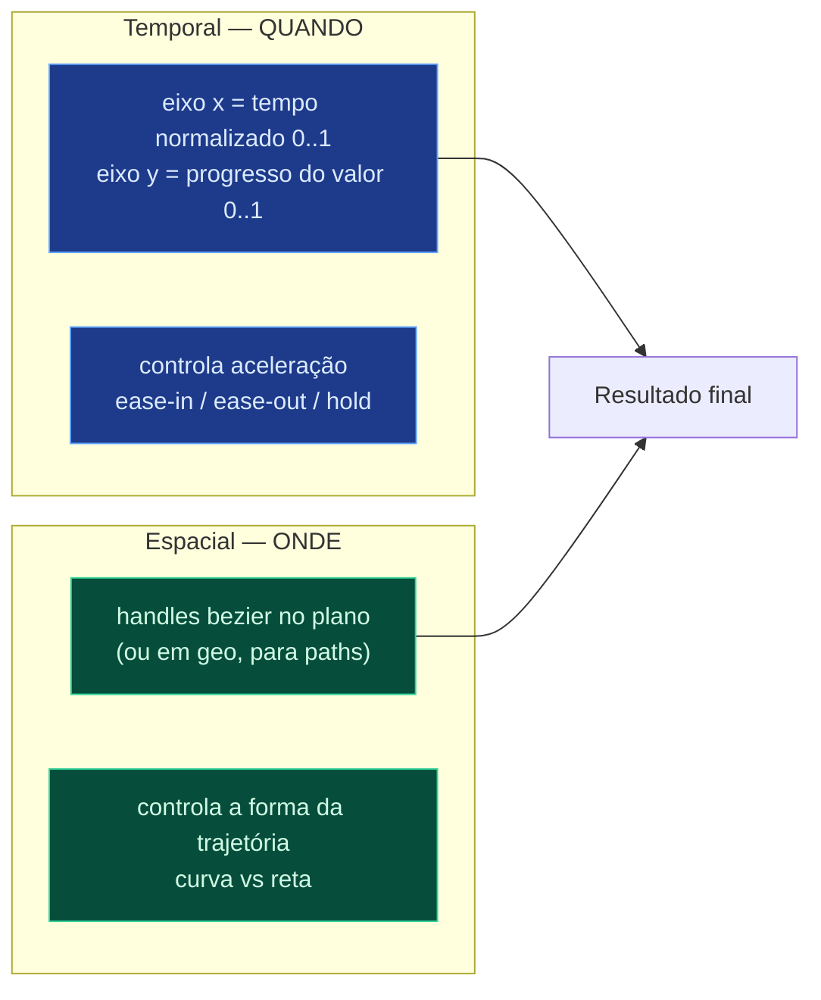
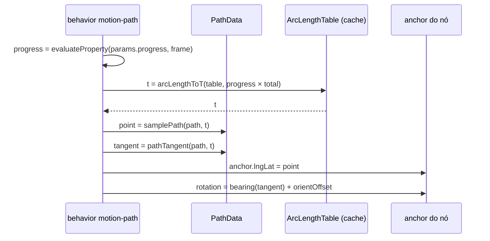

# 03 — Modelo de dados

Este documento define as estruturas de dados centrais. É a referência normativa
para o schema (`packages/schema`) e para o formato de arquivo
([04-PROJECT-FORMAT.md](04-PROJECT-FORMAT.md)).

---

## 1. Hierarquia geral



---

## 2. Tempo

Tempo é **frame inteiro**. Sempre. Segundos são apresentação.

```ts
type Frame = number; // inteiro ≥ 0
type Seconds = number; // derivado; nunca persistido como tempo de keyframe

interface TimeBase {
  fps: number; // 24 | 25 | 30 | 50 | 60 | 120
  dropFrame: boolean; // NTSC 29.97/59.94
}
```

Cada composição tem seu próprio `fps`. Um keyframe no frame 90 significa 1,5 s a
60 fps e 3 s a 30 fps. Mudar o fps de uma composição existente é uma operação
explícita com duas opções — **remapear** (preserva o tempo em segundos,
recalculando frames) ou **reinterpretar** (preserva os números dos frames,
alterando a duração). Nunca implícita.

Motivo de frames serem canônicos: [ADR-004](adr/ADR-004-time-in-frames.md).

### Intervalo temporal do nó

```ts
interface TimeRange {
  in: Frame; // primeiro frame visível (inclusivo)
  out: Frame; // último frame visível (inclusivo)
}
```

Fora do `TimeRange` o nó não é avaliado nem desenhado. Isso é o _layer duration
bar_ do After Effects.

`timeRemap` (opcional) é uma propriedade animável que remapeia o tempo interno do
nó — permite congelar, inverter, acelerar. Só faz sentido em nós com conteúdo
temporal (vídeo, pré-composição, sprite animado).

---

## 3. Espaços de coordenadas

Esta é a parte mais específica do domínio e a que não existe em editores de
animação genéricos.

Um objeto responde a duas perguntas independentes:

1. **Onde ele está ancorado?** → `anchor`
2. **Qual o tamanho dele?** → `size`



```ts
type Anchor =
  | { space: "geo"; lngLat: Vec2; altitude?: number } // metros acima do terreno
  | { space: "comp"; position: Vec2 } // px, origem no canto sup. esq.
  | { space: "parent"; offset: Vec2 }; // px relativos ao pai

type SizeSpec =
  | { mode: "screen"; size: Vec2 } // px na tela
  | { mode: "ground"; meters: Vec2 }; // metros no chão

type RotationReference =
  | "screen" // graus na tela; ignora a câmera
  | "geo-bearing"; // graus a partir do norte; contra-rotaciona com o bearing do mapa
```

### As combinações e o que significam

| anchor   | size     | rotation      | Caso de uso                                                                             |
| -------- | -------- | ------------- | --------------------------------------------------------------------------------------- |
| `geo`    | `screen` | `geo-bearing` | **Unidade militar.** Fica no lugar, mantém tamanho legível, aponta na direção de marcha |
| `geo`    | `ground` | `geo-bearing` | **Área de efeito.** Raio de explosão de 5 km, zona de controle, alcance de artilharia   |
| `comp`   | `screen` | `screen`      | **Elemento de HUD.** Título, legenda, logo, barra de tempo                              |
| `parent` | `screen` | `screen`      | **Adorno.** Rótulo de unidade, ícone de status, bandeira acima do tanque                |

O caso `geo` + `screen` é o mais comum e o mais sutil: a _posição_ é geográfica
(escala com o mapa) mas o _tamanho_ é de tela (não escala). Sem essa separação,
um tanque em zoom 3 teria 0,4 px, e em zoom 14 encheria a tela.

O caso `geo` + `ground` é o oposto: um raio de explosão de 5 km **deve** encolher
ao dar zoom out, porque representa distância real.

`altitude` no anchor geo importa para aeronaves e para terreno 3D: um bombardeiro
a 8000 m projeta em ponto de tela diferente de um tanque no mesmo lng/lat quando
a câmera tem pitch.

### Ordem de resolução

Obrigatória. Trocar a ordem produz erro sutil de escala ou rotação.

```
1. evaluate    → valores animados brutos (offsets, escala, rotação, opacidade)
2. anchor      → ponto no mundo, via ProjectorPort  (geo → px)
3. size        → dimensão em px (ground: metros × metersPerPixel(lat))
4. local       → matriz local (anchorPoint, escala, rotação, skew, offset animado)
5. hierarquia  → multiplica pela matriz mundial do pai
6. draw        → emite comando de desenho
```

O passo 2 usa `ProjectorPort`, que delega ao `transform` do MapLibre — nunca
matemática de Mercator própria. Ver invariante em
[02-MODULES.md § gis](02-MODULES.md#gis).

---

## 4. Nó

Nós vivem num **mapa plano por id**, com ordem em `children[]`. Não é árvore
aninhada. Motivo: [ADR-008](adr/ADR-008-flat-node-map.md).

```ts
interface Node<P = unknown> {
  // Identidade
  id: string; // "nd_7f3a2b" — estável para sempre
  type: string; // resolvido pelo NodeTypeRegistry
  name: string; // editável pelo usuário

  // Hierarquia
  parent: string | null; // null só para a raiz
  children: string[]; // ordem de desenho: índice 0 desenha primeiro (mais atrás)

  // Estado de layer (estilo After Effects)
  enabled: boolean; // olho
  locked: boolean; // cadeado
  solo: boolean; // isolar
  shy: boolean; // esconder da timeline
  label: LabelColor; // cor de identificação

  // Tempo
  timeRange: TimeRange;
  timeRemap: AnimatableProperty<Frame> | null;

  // Espaço
  anchor: Anchor;
  size: SizeSpec;
  transform: Transform;

  // Aparência
  blendMode: BlendMode;
  motionBlur: boolean;

  // Conteúdo e comportamento
  props: P; // específico do tipo, validado pelo registry
  effects: EffectInstanceData[];
  behaviors: BehaviorInstanceData[];
  actions: ActionInstanceData[];
}

interface Transform {
  position: AnimatableProperty<Vec2>; // offset em px sobre o anchor resolvido
  rotation: AnimatableProperty<number>; // graus
  scale: AnimatableProperty<Vec2>; // multiplicador; 1 = tamanho de `size`
  opacity: AnimatableProperty<number>; // 0..1
  anchorPoint: AnimatableProperty<Vec2>; // 0..1 normalizado; pivô de rotação/escala
  skew: AnimatableProperty<Vec2>;
  rotationReference: RotationReference; // não animável
}
```

Note que `anchor` é a posição **base** (geográfica ou de quadro) e
`transform.position` é um **offset animado em pixels** sobre ela. Essa separação
permite duas coisas ao mesmo tempo: mover um objeto pelo mapa (mudando `anchor`,
via keyframes em path ou via `anchor` animável) e sacudi-lo na tela (offset,
para tremor de explosão) sem que uma coisa interfira na outra.

Quando um objeto precisa **percorrer** o mapa, o caminho canônico é um
`behavior` de `motion-path` que contribui para o `anchor` geo — não keyframes de
`position` em pixels. Keyframes em pixels quebram quando a câmera se move.

### Categorias de tipo

Registradas em `NodeTypeRegistry`; esta lista é o alvo, não é fechada.

| Categoria        | Tipos                                                                                                                         |
| ---------------- | ----------------------------------------------------------------------------------------------------------------------------- |
| `structure`      | `group`, `folder`, `null` (objeto nulo para parentesco), `precomp`                                                            |
| `text`           | `text.title`, `text.label`, `text.callout`, `text.date`, `text.counter`                                                       |
| `media`          | `image`, `svg`, `video`, `sprite-sheet`                                                                                       |
| `shape`          | `shape.arrow`, `shape.line`, `shape.polygon`, `shape.circle`, `shape.path`, `shape.bracket`                                   |
| `geo`            | `geo.border`, `geo.area`, `geo.region-fill`, `geo.frontline`, `geo.hatch`                                                     |
| `unit`           | `unit.infantry`, `unit.armor`, `unit.air`, `unit.naval`, `unit.sub`, `unit.artillery`, `unit.missile`, `unit.convoy`          |
| `symbol`         | `symbol.flag`, `symbol.icon`, `symbol.nato` (APP-6), `symbol.marker`                                                          |
| `effect-emitter` | `emitter.explosion`, `emitter.smoke`, `emitter.fire`, `emitter.trail`, `emitter.shockwave`, `emitter.sparks`, `emitter.water` |

---

## 5. Propriedade animável

```ts
interface AnimatableProperty<T> {
  value: T; // usado quando keyframes está vazio
  keyframes: Keyframe<T>[]; // ordenado por frame, crescente, sem duplicatas
  expression: string | null; // reservado — Fase 11
}

interface Keyframe<T> {
  id: string; // "kf_..." — estável, sobrevive a reordenação
  frame: Frame;
  value: T;
  out: EasingHandle; // easing SAINDO deste keyframe
  in: EasingHandle; // easing ENTRANDO neste keyframe
  spatial?: SpatialHandles; // só em propriedades de posição
  roving?: boolean; // tempo determinado pela velocidade, não fixo
}

type EasingHandle =
  | { kind: "hold" } // degrau; mantém o valor
  | { kind: "linear" }
  | { kind: "bezier"; handle: Vec2 }; // ponto de controle normalizado
```

### Interpolação temporal vs espacial

São dois sistemas independentes. Confundi-los é a causa mais comum de animação
com aparência errada.



Um avião pode fazer uma curva ampla (espacial) com velocidade constante
(temporal linear). Ou voar em linha reta (espacial linear) desacelerando
(temporal ease-out). As duas combinações são válidas e independentes.

Cálculo de um segmento temporal entre `kf[i]` e `kf[i+1]`:

```
1. x  = (frame − kf[i].frame) / (kf[i+1].frame − kf[i].frame)     // 0..1
2. t  = solveBezierX(kf[i].out.handle, kf[i+1].in.handle, x)      // Newton-Raphson
3. y  = cubicBezierY(kf[i].out.handle, kf[i+1].in.handle, t)      // 0..1
4. v  = interpolateValue(kf[i].value, kf[i+1].value, y)
```

O passo 2 existe porque a curva bezier é parametrizada por `t`, mas precisamos
avaliá-la em função de `x` (o tempo). É a mesma matemática de `cubic-bezier()`
em CSS e das curvas do After Effects.

### Interpolação por tipo de valor

| Tipo                        | Método                              | Observação                                                                  |
| --------------------------- | ----------------------------------- | --------------------------------------------------------------------------- |
| `number`                    | lerp                                | —                                                                           |
| `Vec2` / `Vec3`             | lerp por componente                 | com handles espaciais quando é posição                                      |
| `Color`                     | lerp em **OkLab**                   | evita o cinza morto do lerp em RGB                                          |
| `angle`                     | caminho mais curto **ou** acumulado | `rotationUnwrap` no keyframe decide; sem isso, 350° → 10° gira ao contrário |
| `Anchor` (geo)              | great-circle **ou** Mercator-linear | por tipo de unidade                                                         |
| `boolean`, `enum`, `string` | `hold` forçado                      | interpolar não faz sentido                                                  |
| `Path`                      | morph por vértice                   | exige mesma contagem de vértices; senão, `hold` + aviso                     |

Interpolar cor em OkLab é uma escolha de qualidade visual: um gradiente de
vermelho para azul em RGB passa por um cinza sujo; em OkLab mantém saturação.
Para animações de mapa com áreas de controle mudando de cor, a diferença é visível.

### Presets de easing

```ts
const EASE_PRESETS = {
  linear: { out: linear, in: linear },
  ease: { out: bezier(0.25, 0.1), in: bezier(0.25, 1) },
  easeIn: { out: bezier(0.42, 0), in: bezier(1, 1) },
  easeOut: { out: bezier(0, 0), in: bezier(0.58, 1) },
  easeInOut: { out: bezier(0.42, 0), in: bezier(0.58, 1) },
  cinematicIn: { out: bezier(0.16, 1), in: bezier(0.3, 1) }, // arranque suave, longo
  snap: { out: bezier(0.9, 0), in: bezier(0.1, 1) }, // impacto, para explosões
  hold: { out: hold, in: hold },
} as const;
```

`cinematicIn` e `snap` existem porque este domínio tem dois vocabulários visuais
distintos: movimento de câmera quer aceleração longa e suave; impacto de bomba
quer partida quase instantânea.

---

## 6. Câmera

A câmera fala a linguagem do MapLibre diretamente. Zero conversão, zero deriva.

```ts
interface Camera {
  center: AnimatableProperty<Vec2>; // [lng, lat]
  zoom: AnimatableProperty<number>; // escala logarítmica MapLibre (0..24)
  bearing: AnimatableProperty<number>; // graus, 0 = norte no topo
  pitch: AnimatableProperty<number>; // graus, 0 = topo-baixo, máx ~85
  roll: AnimatableProperty<number>; // graus — inclinação lateral (dutch angle)
  fov: AnimatableProperty<number>; // graus

  follow: CameraFollow | null; // seguir um nó
  path: CameraPath | null; // percorrer um path
}

interface CameraFollow {
  nodeId: string;
  offset: Vec2; // px na tela
  damping: number; // 0 = rígido, 1 = muito frouxo
  matchBearing: boolean; // gira o mapa junto com o objeto
}
```

**Nota sobre `damping` e determinismo.** Suavização normalmente é acumulativa
(depende do frame anterior) — o que violaria a pureza da avaliação. A solução é
`damping` implementado como **filtro de janela fixa**: o valor no frame `f` é uma
média ponderada de `N` frames de posição-alvo em torno de `f`, calculada do zero.
Custa mais, mas mantém `evaluate(doc, f)` puro. `N` é derivado de `damping`.

Interpolação de `zoom` é linear no valor logarítmico. Isso já dá aproximação de
aparência natural — interpolar a escala linearmente causaria aceleração aparente
no fim do movimento.

---

## 7. Paths

Paths são compartilhados no nível do projeto (não do nó), porque a mesma rota
serve para vários objetos: a estrada que o comboio percorre e a linha de avanço
desenhada na tela.

```ts
interface PathData {
  id: string;
  name: string;
  space: "geo" | "comp";
  vertices: PathVertex[];
  closed: boolean;
  interpolation: "linear" | "bezier" | "catmull-rom";
  geodesic: boolean; // segmentos como great-circle
}

interface PathVertex {
  point: Vec2; // [lng, lat] se geo; px se comp
  inHandle: Vec2 | null; // relativo a point
  outHandle: Vec2 | null;
  altitude?: number; // metros — trajetória de voo
}
```

### Como um objeto percorre um path



A tabela de comprimento de arco existe para dar **velocidade uniforme**. Sem ela,
um objeto acelera nas curvas fechadas e desacelera nas retas — porque o parâmetro
`t` de bezier não é proporcional a distância. É um erro clássico e muito visível.

`progress` é uma propriedade animável comum: com easing dá partida e frenagem;
com keyframes intermediários dá parada no meio do caminho; com valor > 1 e
`loop` dá patrulha.

---

## 8. Efeitos, comportamentos e ações

Três mecanismos distintos, frequentemente confundidos.

```ts
// EFEITO: transforma pixels. Roda depois do desenho do nó.
interface EffectInstanceData {
  id: string;
  type: string;
  enabled: boolean;
  params: Record<string, AnimatableProperty<unknown> | unknown>;
}

// COMPORTAMENTO: contribui valores de propriedade. Roda durante evaluate().
interface BehaviorInstanceData {
  id: string;
  type: string;
  enabled: boolean;
  params: Record<string, unknown>;
}

// AÇÃO: gera nós, keyframes e efeitos. Live (em evaluate) ou baked (no documento).
interface ActionInstanceData {
  id: string;
  type: string;
  enabled: boolean;
  mode: "live" | "baked";
  startFrame: Frame;
  params: Record<string, unknown>;
}
```

|                     | Efeito                         | Comportamento                            | Ação                                   |
| ------------------- | ------------------------------ | ---------------------------------------- | -------------------------------------- |
| Atua sobre          | pixels                         | propriedades                             | estrutura da cena                      |
| Quando roda         | após render                    | dentro de `evaluate()`                   | `evaluate()` (live) ou uma vez (baked) |
| Exemplos            | glow, blur, sombra, partículas | motion-path, auto-orient, follow, wiggle | bombardear, avançar, dogfight          |
| Editável em detalhe | parâmetros                     | parâmetros                               | parâmetros (live) ou keyframes (baked) |

Uma Action em modo `baked` deixa de existir como Action: seus keyframes viram
keyframes normais, editáveis um a um. É caminho de mão única (com undo), e é o
que impede a Action de ser uma caixa-preta.

---

## 9. Composição

```ts
interface Composition {
  id: string;
  name: string;

  fps: number;
  duration: Frame;
  width: number; // px — resolução de referência
  height: number;
  pixelAspect: number;
  workArea: [Frame, Frame]; // região de preview/render
  background: Color;

  map: MapSettings;
  camera: Camera;

  root: string; // id do nó raiz
  nodes: Record<string, Node>; // mapa plano

  markers: Marker[];
  guides: Guide[];
  seed: number; // semente-mãe de todo efeito da composição
}

interface MapSettings {
  styleId: string;
  projection: "mercator" | "globe" | "albers" | "equal-earth";
  terrain: { enabled: boolean; exaggeration: number; sourceId: string } | null;
  visible: boolean; // false = exportar só overlays (modo matte/alpha)
  fadeDuration: number; // 0 obrigatório em export: desliga transição de rótulos
}

interface Marker {
  frame: Frame;
  label: string;
  color: Color;
  duration?: Frame; // marcador de faixa
  comment?: string;
}
```

Dois campos merecem atenção:

- **`seed`** — semente-mãe da composição. Toda aleatoriedade de efeito deriva de
  `hashSeed(comp.seed, nodeId, effectId, index)`. Mudar `seed` re-embaralha todas
  as explosões da cena de uma vez, deterministicamente. É um recurso criativo e um
  requisito de reprodutibilidade ao mesmo tempo.
- **`fadeDuration: 0`** — MapLibre faz cross-fade de rótulos ao longo de ~300 ms de
  _tempo real_. Em export isso produziria opacidade de rótulo diferente a cada
  execução. Deve ser 0 no render. É exatamente o tipo de detalhe que só aparece na
  Fase 8 se não for registrado agora.

`width`/`height` são a resolução **de referência** para posicionamento em espaço
`comp`. Exportar em 8K não move nada: o layout escala por `pixelRatio`. Sem essa
separação, trocar a resolução de saída reposicionaria todos os títulos.

---

## 10. Documento

```ts
interface ProjectDocument {
  schemaVersion: number;
  id: string;
  name: string;
  settings: ProjectSettings;

  assets: AssetDescriptor[];
  geoData: GeoDataDescriptor[];
  paths: Record<string, PathData>;
  styles: MapStyleDescriptor[];
  palettes: Palette[]; // paletas por facção/nação
  compositions: Composition[];
}

interface ProjectSettings {
  defaultFps: number;
  defaultResolution: Vec2;
  units: "metric" | "imperial";
  dateFormat: string;
  language: string;
  colorSpace: "srgb" | "display-p3";
}
```

### Invariantes do documento

Verificados por `validateDocument()` no load, no save e (em dev) após cada comando.

1. Todo `parent` referencia nó existente na mesma composição, ou `null`.
2. `children[]` de um nó contém exatamente os ids cujo `parent` é esse nó,
   na ordem de desenho. Bidirecionalidade consistente.
3. Nenhum ciclo de parentesco.
4. Todo `assetId` referenciado existe em `assets[]`.
5. Todo `pathId` referenciado existe em `paths{}`.
6. `keyframes[]` é ordenado por `frame`, sem frames duplicados.
7. `timeRange.in ≤ timeRange.out`.
8. Todo `node.type` está registrado no `NodeTypeRegistry`. **Exceção:** ao abrir um
   projeto com tipo desconhecido (plugin ausente), o nó é preservado intacto e
   marcado `unresolved` — nunca descartado. Salvar de volta não perde dados.
9. `composition.root` existe e tem `parent: null`.

O invariante 8 é o que permite trocar plugins sem destruir projetos antigos.

---

## 11. Cena avaliada (runtime)

Saída de `evaluate()`. Não é persistida. Existe para deixar explícito o que é
dado e o que é derivado.

```ts
interface EvaluatedScene {
  readonly frame: Frame;
  readonly camera: EvaluatedCamera; // valores concretos, sem keyframes
  readonly nodes: ReadonlyMap<string, EvaluatedNode>;
  readonly drawOrder: readonly string[]; // achatado, resolvido, estável
}

interface EvaluatedNode<P = unknown> {
  readonly id: string;
  readonly type: string;
  readonly synthetic: boolean; // criado por Action em modo live
  readonly anchor: Anchor; // já com contribuição de behaviors
  readonly size: SizeSpec;
  readonly transform: ResolvedTransform; // números, não propriedades
  readonly props: P;
  readonly effects: readonly ResolvedEffect[];
  readonly opacity: number; // acumulado pela hierarquia
  readonly visible: boolean; // enabled ∧ dentro do timeRange ∧ opacity > 0
}

// Depois do layout (projeção aplicada)
interface ScreenScene {
  readonly frame: Frame;
  readonly projector: ProjectorSnapshot;
  readonly layouts: ReadonlyMap<string, NodeLayout>;
  readonly drawOrder: readonly string[];
}
interface NodeLayout {
  readonly matrix: Mat2D; // local → tela
  readonly sizePx: Vec2;
  readonly bounds: Rect; // para culling e hit-testing
  readonly culled: boolean;
}
```

Duas etapas separadas (`EvaluatedScene` → `ScreenScene`) porque a primeira é pura
e testável sem GPU nem mapa, e a segunda precisa da projeção do frame. Essa
fronteira é o que permite testar toda a lógica de animação em Node puro.
