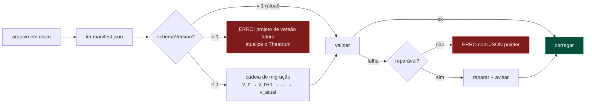

# 04 — Formato de projeto `.theatrum`

Especificação normativa do arquivo de projeto. Versão do schema: **1**.

---

## 1. Container

Um `.theatrum` é um **arquivo ZIP** com estrutura fixa.

```
Operacao-Barbarossa.theatrum          (ZIP)
├─ manifest.json                      metadados do container — sempre o 1º membro, sem compressão
├─ project.json                       o ProjectDocument (única fonte de verdade)
├─ assets/                            binários endereçados por conteúdo
│  ├─ 3f/3f8a91c2....png
│  ├─ a7/a7b30e51....svg
│  └─ e2/e2c4f019....geojson
├─ thumbnails/
│  └─ cmp_main.webp                   pôster da composição (para o navegador de projetos)
└─ meta/                              opcional — nada aqui afeta o render
   └─ notes.md                        anotações livres do usuário
```

O layout dos painéis não pertence ao projeto. Ele é uma preferência global
persistida em `app.getPath("userData")/workspace.json`; seleção, playhead e zoom
da timeline são estado volátil. Isso impede que abrir um projeto reorganize o
ambiente do operador e mantém o container livre de timestamps de sessão.

**Por que ZIP e não pasta ou banco de dados**

| Alternativa           | Problema                                                                         |
| --------------------- | -------------------------------------------------------------------------------- |
| Pasta aberta          | Um projeto = um arquivo é requisito de usabilidade; mover/copiar/versionar       |
| SQLite                | Binário opaco; impossível inspecionar ou gerar por IA                            |
| JSON único com base64 | Um PNG de 4 MB vira 5,3 MB de texto; arquivo ilegível; parse lento               |
| ZIP                   | Inspecionável com qualquer ferramenta; `project.json` legível; binários intactos |

`manifest.json` é o primeiro membro e fica **sem compressão**, para que a leitura
de metadados (nome, versão, thumbnail) não exija descomprimir nada. O navegador de
projetos lista 200 arquivos instantaneamente.

### `manifest.json`

```json
{
  "format": "theatrum-project",
  "container": 1,
  "schemaVersion": 1,
  "app": { "name": "Theatrum", "version": "0.1.0" },
  "project": { "id": "prj_8c1f04", "name": "Operação Barbarossa" },
  "created": "2026-07-26T12:04:11.000Z",
  "modified": "2026-07-26T15:41:52.000Z",
  "stats": { "compositions": 3, "nodes": 214, "assets": 47, "durationFrames": 5400 }
}
```

Todos os campos temporais e voláteis vivem **aqui**, nunca em `project.json`.
Isso é o que permite o save ser determinístico: salvar o mesmo documento duas
vezes produz `project.json` byte-idêntico, e portanto um diff limpo.

---

## 2. Endereçamento de assets

```
assets/<sha256[0:2]>/<sha256><ext>
```

O hash é do **conteúdo do arquivo**, não do nome. Consequências:

- Importar o mesmo PNG por dois caminhos diferentes armazena um único arquivo.
- Trocar um asset por outro idêntico não gera diff.
- Nenhum caminho absoluto no documento — o projeto é portátil.
- Detecção de corrupção é grátis: rehash e compare.

Referências no documento usam duas formas:

| Forma                       | Significado                                       |
| --------------------------- | ------------------------------------------------- |
| `assets/3f/3f8a91c2....png` | embutido no container                             |
| `lib:unit.armor.t34-85`     | biblioteca embutida no app (não vai no container) |

A forma `lib:` mantém o arquivo pequeno: um projeto com 300 tanques não carrega
300 cópias do sprite. O custo é que o projeto depende da versão do app — aceitável
para uso interno, e mitigado por `exportBundle()`, que materializa todas as
referências `lib:` dentro do container para arquivamento de longo prazo.

---

## 3. `project.json`

Exemplo completo, reduzido mas estruturalmente fiel. Comentários `//` **não** são
válidos em JSON; aparecem aqui apenas como anotação da spec.

```json
{
  "schemaVersion": 1,
  "id": "prj_8c1f04",
  "name": "Operação Barbarossa",

  "settings": {
    "defaultFps": 60,
    "defaultResolution": [3840, 2160],
    "units": "metric",
    "dateFormat": "d 'de' MMMM 'de' yyyy",
    "language": "pt-BR",
    "colorSpace": "srgb"
  },

  "assets": [
    {
      "id": "ast_t34",
      "kind": "sprite-sheet",
      "src": "lib:unit.armor.t34-85",
      "meta": { "frames": 8, "frameSize": [64, 64], "pivot": [0.5, 0.5] }
    },
    {
      "id": "ast_map_overlay",
      "kind": "raster",
      "src": "assets/3f/3f8a91c2d4e5f6a7b8c9d0e1f2a3b4c5d6e7f8a9.png",
      "meta": { "size": [2048, 1536], "originalName": "mapa-historico-1941.png" }
    }
  ],

  "geoData": [
    {
      "id": "geo_borders_1941",
      "kind": "geojson",
      "src": "assets/e2/e2c4f019....geojson",
      "meta": { "featureCount": 34, "properties": ["name", "faction"] }
    }
  ],

  "paths": {
    "pth_army_north": {
      "id": "pth_army_north",
      "name": "Grupo de Exércitos Norte",
      "space": "geo",
      "closed": false,
      "interpolation": "bezier",
      "geodesic": false,
      "vertices": [
        { "point": [21.01, 52.23], "inHandle": null, "outHandle": [1.4, 0.6] },
        { "point": [24.1, 56.95], "inHandle": [-1.2, -0.8], "outHandle": [0.9, 1.1] },
        { "point": [30.31, 59.93], "inHandle": [-0.7, -1.0], "outHandle": null }
      ]
    }
  },

  "styles": [
    {
      "id": "style_dark_relief",
      "name": "Relevo Escuro",
      "src": "data/styles/dark-relief.json",
      "kind": "maplibre-style"
    }
  ],

  "palettes": [
    {
      "id": "pal_ww2",
      "name": "Segunda Guerra",
      "colors": {
        "axis": "#8B2635",
        "allies": "#2C5F8D",
        "soviet": "#A83232",
        "neutral": "#6B7280"
      }
    }
  ],

  "compositions": [
    {
      "id": "cmp_main",
      "name": "Principal",

      "fps": 60,
      "duration": 5400,
      "width": 3840,
      "height": 2160,
      "pixelAspect": 1,
      "workArea": [0, 5400],
      "background": "#0A0E14",
      "seed": 20260726,

      "map": {
        "styleId": "style_dark_relief",
        "projection": "mercator",
        "terrain": { "enabled": true, "exaggeration": 1.4, "sourceId": "terrain_dem" },
        "visible": true,
        "fadeDuration": 0
      },

      "camera": {
        "center": {
          "value": [25.0, 54.0],
          "keyframes": [
            {
              "id": "kf_c1",
              "frame": 0,
              "value": [21.01, 52.23],
              "out": { "kind": "bezier", "handle": [0.16, 1] },
              "in": { "kind": "linear" }
            },
            {
              "id": "kf_c2",
              "frame": 300,
              "value": [30.31, 59.93],
              "out": { "kind": "linear" },
              "in": { "kind": "bezier", "handle": [0.3, 1] }
            }
          ],
          "expression": null
        },
        "zoom": { "value": 6.2, "keyframes": [], "expression": null },
        "bearing": { "value": 0, "keyframes": [], "expression": null },
        "pitch": { "value": 45, "keyframes": [], "expression": null },
        "roll": { "value": 0, "keyframes": [], "expression": null },
        "fov": { "value": 36.87, "keyframes": [], "expression": null },
        "follow": null,
        "path": null
      },

      "root": "nd_root",

      "nodes": {
        "nd_root": {
          "id": "nd_root",
          "type": "group",
          "name": "Cena",
          "parent": null,
          "children": ["nd_army_n", "nd_title"],
          "enabled": true,
          "locked": false,
          "solo": false,
          "shy": false,
          "label": "none",
          "timeRange": { "in": 0, "out": 5400 },
          "timeRemap": null,
          "anchor": { "space": "comp", "position": [0, 0] },
          "size": { "mode": "screen", "size": [3840, 2160] },
          "transform": {
            "position": { "value": [0, 0], "keyframes": [], "expression": null },
            "rotation": { "value": 0, "keyframes": [], "expression": null },
            "scale": { "value": [1, 1], "keyframes": [], "expression": null },
            "opacity": { "value": 1, "keyframes": [], "expression": null },
            "anchorPoint": { "value": [0, 0], "keyframes": [], "expression": null },
            "skew": { "value": [0, 0], "keyframes": [], "expression": null },
            "rotationReference": "screen"
          },
          "blendMode": "normal",
          "motionBlur": false,
          "props": {},
          "effects": [],
          "behaviors": [],
          "actions": []
        },

        "nd_army_n": {
          "id": "nd_army_n",
          "type": "unit.armor",
          "name": "GE Norte — 4º Pz",
          "parent": "nd_root",
          "children": [],
          "enabled": true,
          "locked": false,
          "solo": false,
          "shy": false,
          "label": "red",
          "timeRange": { "in": 60, "out": 3600 },
          "timeRemap": null,

          "anchor": { "space": "geo", "lngLat": [21.01, 52.23] },
          "size": { "mode": "screen", "size": [56, 56] },

          "transform": {
            "position": { "value": [0, 0], "keyframes": [], "expression": null },
            "rotation": { "value": 0, "keyframes": [], "expression": null },
            "scale": { "value": [1, 1], "keyframes": [], "expression": null },
            "opacity": {
              "value": 1,
              "keyframes": [
                {
                  "id": "kf_o1",
                  "frame": 60,
                  "value": 0,
                  "out": { "kind": "bezier", "handle": [0.42, 0] },
                  "in": { "kind": "linear" }
                },
                {
                  "id": "kf_o2",
                  "frame": 90,
                  "value": 1,
                  "out": { "kind": "linear" },
                  "in": { "kind": "bezier", "handle": [0.58, 1] }
                }
              ],
              "expression": null
            },
            "anchorPoint": { "value": [0.5, 0.5], "keyframes": [], "expression": null },
            "skew": { "value": [0, 0], "keyframes": [], "expression": null },
            "rotationReference": "geo-bearing"
          },

          "blendMode": "normal",
          "motionBlur": true,

          "props": {
            "assetId": "ast_t34",
            "tint": "#8B2635",
            "showLabel": true,
            "labelText": "4. Panzergruppe"
          },

          "effects": [
            {
              "id": "fx_shadow",
              "type": "drop-shadow",
              "enabled": true,
              "params": { "distance": 3, "angle": 135, "opacity": 0.5, "blur": 4 }
            }
          ],

          "behaviors": [
            {
              "id": "bhv_march",
              "type": "motion-path",
              "enabled": true,
              "params": {
                "pathId": "pth_army_north",
                "progress": {
                  "value": 0,
                  "keyframes": [
                    {
                      "id": "kf_p1",
                      "frame": 90,
                      "value": 0,
                      "out": { "kind": "bezier", "handle": [0.16, 1] },
                      "in": { "kind": "linear" }
                    },
                    {
                      "id": "kf_p2",
                      "frame": 3300,
                      "value": 1,
                      "out": { "kind": "linear" },
                      "in": { "kind": "bezier", "handle": [0.3, 1] }
                    }
                  ],
                  "expression": null
                },
                "autoOrient": true,
                "orientOffset": 0,
                "interpolation": "mercator"
              }
            }
          ],

          "actions": []
        },

        "nd_title": {
          "id": "nd_title",
          "type": "text.title",
          "name": "Título de abertura",
          "parent": "nd_root",
          "children": [],
          "enabled": true,
          "locked": false,
          "solo": false,
          "shy": false,
          "label": "blue",
          "timeRange": { "in": 0, "out": 300 },
          "timeRemap": null,
          "anchor": { "space": "comp", "position": [200, 180] },
          "size": { "mode": "screen", "size": [1200, 200] },
          "transform": {
            "position": { "value": [0, 0], "keyframes": [], "expression": null },
            "rotation": { "value": 0, "keyframes": [], "expression": null },
            "scale": { "value": [1, 1], "keyframes": [], "expression": null },
            "opacity": { "value": 1, "keyframes": [], "expression": null },
            "anchorPoint": { "value": [0, 0], "keyframes": [], "expression": null },
            "skew": { "value": [0, 0], "keyframes": [], "expression": null },
            "rotationReference": "screen"
          },
          "blendMode": "normal",
          "motionBlur": false,
          "props": {
            "text": "22 de junho de 1941",
            "font": "Inter",
            "weight": 700,
            "sizePx": 96,
            "color": "#F5F5F4",
            "align": "left",
            "reveal": { "kind": "per-character", "durationFrames": 45 }
          },
          "effects": [],
          "behaviors": [],
          "actions": []
        }
      },

      "markers": [
        { "frame": 0, "label": "Início da Operação", "color": "#DC2626" },
        { "frame": 1800, "label": "Cerco de Minsk", "color": "#F59E0B", "duration": 240 }
      ],

      "guides": [],

      "$note": "nodes é mapa plano; a ordem de desenho vem de children[]"
    }
  ]
}
```

---

## 4. Regras de serialização

Estas regras existem para que o save seja determinístico e o diff, legível.

1. **Chaves ordenadas.** Objetos são serializados com chaves em ordem
   lexicográfica, **exceto** os campos de identidade (`id`, `type`, `name`), que
   vêm primeiro nessa ordem. Legibilidade humana e estabilidade de diff.
2. **Indentação de 2 espaços, `\n` como quebra de linha.** Em qualquer plataforma.
3. **Números:** menor representação decimal que faz round-trip exato
   (`JSON.stringify` de `number` já garante). Coordenadas geográficas limitadas a
   7 casas (≈ 1,1 cm) — mais que isso é ruído de ponto flutuante.
4. **Nada de `undefined`.** Campo ausente ou `null` explícito. `undefined`
   desaparece no `JSON.stringify` e cria ambiguidade entre "não definido" e
   "definido como nada".
5. **Nada volátil em `project.json`:** sem timestamp, sem versão de app, sem
   caminho de máquina, sem contador. Tudo isso mora no `manifest.json`.
6. **Cores como string hex** `#RRGGBB` ou `#RRGGBBAA`, minúsculas. Sem `rgb()`,
   sem array. Uma representação só.
7. **Chaves `$`-prefixadas são ignoradas pelo parser** e preservadas no round-trip.
   Espaço para anotação humana ou de IA sem quebrar validação.

A regra 5 é o que torna possível colocar o projeto sob controle de versão e ver
um diff que reflete apenas mudanças reais de conteúdo.

---

## 5. Versionamento e migração



```ts
registerMigration(1, 2, (doc) => {
  // Exemplo hipotético: `size: Vec2` passa a ser `size: SizeSpec`
  for (const comp of doc.compositions) {
    for (const node of Object.values(comp.nodes)) {
      if (Array.isArray(node.size)) {
        node.size = { mode: "screen", size: node.size };
      }
    }
  }
  doc.schemaVersion = 2;
  return doc;
});
```

**Regras de migração:**

- Encadeadas e monotônicas: v1→v2→v3. Nunca v1→v3 direto (combinatória explode).
- Cada migração tem teste com fixture real capturada na versão antiga, em
  `tests/golden/migrations/v1/`.
- Migração nunca descarta dado que não entende. Campos desconhecidos são
  preservados.
- Abrir um projeto migrado **não** o salva automaticamente. O usuário decide;
  o título mostra "(migrado de v1)" até salvar.
- Versão futura falha limpo com mensagem acionável. Nunca "melhor esforço" —
  carregar parcialmente um projeto de versão futura é como corromper devagar.

### Reparos automáticos permitidos

Coisas que a validação corrige com aviso, em vez de falhar:

| Problema                                | Reparo                                       |
| --------------------------------------- | -------------------------------------------- |
| `children[]` inconsistente com `parent` | reconstrói `children` a partir de `parent`   |
| Keyframes fora de ordem                 | reordena                                     |
| Keyframes duplicados no mesmo frame     | mantém o último, avisa                       |
| `assetId` órfão                         | nó marcado `unresolved`, placeholder visível |
| Nó órfão (parent inexistente)           | reanexa à raiz, avisa                        |
| Ciclo de parentesco                     | quebra no elo mais profundo, avisa           |
| `timeRange.out < in`                    | troca os dois                                |

O critério: reparar o que tem interpretação única e óbvia; falhar no que exigiria
adivinhar intenção.

---

## 6. Formatos auxiliares

| Extensão             | Conteúdo                       | Uso                                       |
| -------------------- | ------------------------------ | ----------------------------------------- |
| `.theatrum`          | projeto completo (ZIP)         | arquivo de trabalho                       |
| `.theatrum-bundle`   | idem, com `lib:` materializado | arquivamento, transferência               |
| `.scene.json`        | Scene Script (alto nível)      | autoria por IA → [05](05-SCENE-SCRIPT.md) |
| `.theatrum-preset`   | subárvore de nós + efeitos     | presets reutilizáveis                     |
| `.theatrum-style`    | MapLibre style + extensões     | estilos de mapa                           |
| `.theatrum-unit`     | UnitTemplate + assets          | pacote de unidade para a biblioteca       |
| `.theatrum-recovery` | autosave incremental           | recuperação de crash                      |

Todos, exceto `.theatrum*` que são ZIP, são JSON simples, validados pelo mesmo
`packages/schema`.

---

## 7. Autosave e recuperação

```
%APPDATA%/Theatrum/recovery/
└─ prj_8c1f04/
   ├─ base.json            snapshot completo, a cada 10 min
   ├─ 000042.patch.json    patches incrementais, a cada 30 s ou 20 comandos
   ├─ 000043.patch.json
   └─ session.json         caminho do projeto, PID, heartbeat
```

Recuperação = `base.json` + aplicar patches em ordem. Custo de autosave é
proporcional à mudança, não ao tamanho do projeto — um projeto de 40 MB não
grava 40 MB a cada 30 segundos.

`session.json` tem heartbeat. Na inicialização, sessão sem heartbeat recente =
crash → oferece recuperação. Fechamento limpo remove o diretório.

Autosave **nunca** escreve no arquivo do usuário. Se o app travar durante um
autosave, o `.theatrum` no disco continua íntegro.

---

## 8. Nome do formato

`Theatrum` e a extensão `.theatrum` são definidos em **uma única constante**:

```ts
// packages/schema/src/branding.ts
export const APP_NAME = "Theatrum";
export const PROJECT_EXTENSION = "theatrum";
export const FORMAT_ID = "theatrum-project";
```

Renomear o produto = editar três linhas. Nenhuma string literal de marca em
outro lugar do código. Se você preferir outro nome, é aqui que muda — e a
migração de arquivos existentes é apenas rename de extensão, já que `FORMAT_ID`
é lido do manifest.
