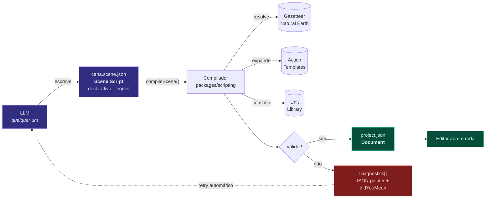
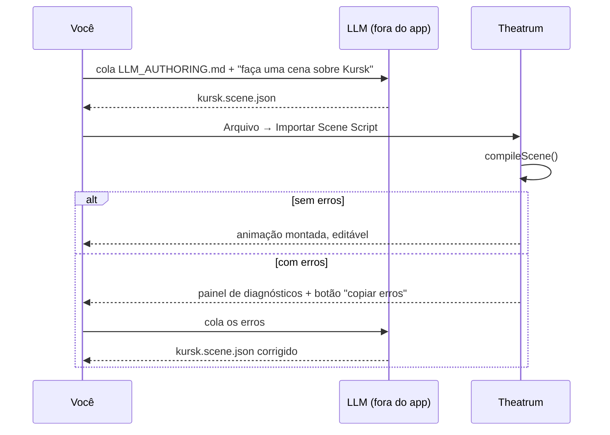

# 05 — Scene Script (autoria por IA)

Formato declarativo de alto nível que qualquer LLM consegue escrever sem conhecer
bezier, matriz de transformação ou numeração de frame.

O editor não contém IA. Contém um **compilador**.

---

## 1. Por que um segundo formato

O `project.json` é completo e explícito — e por isso é péssimo para um LLM
escrever. Um único movimento de tanque exige:

```
1 nó com 24 campos
+ 2 keyframes de opacidade com handles bezier
+ 1 path com 3 vértices e 4 handles
+ 1 behavior motion-path com progress animado
+ 1 conversão de segundos para frames na fps correta
```

Um modelo consegue produzir isso, mas com taxa de erro alta e sem legibilidade.
Pior: qualquer mudança de schema interno invalidaria todos os prompts.

O Scene Script inverte a relação. A mesma animação:

```json
{
  "at": "1.5s",
  "do": "unit.advance",
  "unit": "panzer-4",
  "along": "avanco-norte",
  "duration": "55s"
}
```



O laço de retorno de diagnósticos é intencional: os erros são escritos **para
serem lidos por um modelo**, com JSON pointer e sugestões. Na prática, uma segunda
tentativa resolve quase tudo.

---

## 2. Princípios de design

Cada um existe porque a alternativa produz erro de LLM.

| Princípio                    | Em vez de                  | Porque                                               |
| ---------------------------- | -------------------------- | ---------------------------------------------------- |
| Tempo como string legível    | `frame: 5400`              | `"1m30s"` não exige saber a fps                      |
| Lugares nomeados             | `[36.19, 51.73]`           | `"Kursk"` é verificável; coordenada inventada não    |
| Nomes de path, não geometria | `vertices: [...]`          | `"through": ["Kursk","Orel"]`                        |
| Verbos de ação               | keyframes                  | `"do": "unit.advance"`                               |
| Padrões sensatos em tudo     | 24 campos obrigatórios     | Só o essencial é obrigatório                         |
| Ordem irrelevante            | array de tempo ordenado    | Cada entrada tem `at`; o compilador ordena           |
| IDs legíveis                 | `nd_7f3a2b`                | `"panzer-4"` — o modelo consegue referenciar de novo |
| Erro nunca silencioso        | ignorar campo desconhecido | Campo desconhecido é erro com `didYouMean`           |

O último importa mais do que parece: um LLM que escreve `"durration"` e vê a
animação sem duração não tem como aprender. Um que recebe
`unknown field "durration" at /timeline/3 — did you mean "duration"?` corrige.

---

## 3. Estrutura

```jsonc
{
  "format": "theatrum-scene",
  "version": 1,

  "meta": {/* título, fps, resolução, duração */},
  "map": {/* estilo, projeção, terreno */},
  "defaults": {/* fallbacks para todas as entradas */},

  "places": {/* registro nomeado de coordenadas */},
  "paths": {/* rotas por lugares nomeados */},
  "factions": {/* cores e rótulos por lado */},
  "units": [/* atores em cena */],

  "timeline": [/* o que acontece, e quando */],
}
```

Somente `format`, `version`, `meta` e `timeline` são obrigatórios.

---

## 4. Exemplo completo

Este arquivo é válido e compila numa animação de 1m30s.

```json
{
  "format": "theatrum-scene",
  "version": 1,

  "meta": {
    "title": "Alexandre: da Macedônia à Pérsia",
    "fps": 60,
    "resolution": "3840x2160",
    "duration": "1m30s",
    "background": "#0d1117"
  },

  "map": {
    "style": "historical-parchment",
    "projection": "mercator",
    "terrain": { "enabled": true, "exaggeration": 1.2 }
  },

  "defaults": {
    "unitSize": 56,
    "textFont": "Cinzel",
    "ease": "cinematic",
    "labelPosition": "above"
  },

  "factions": {
    "macedon": { "color": "#C9A227", "label": "Macedônia" },
    "persia": { "color": "#8B2635", "label": "Império Persa" }
  },

  "places": {
    "pella": "Pella, Greece",
    "granicus": [27.2, 40.2],
    "issus": [36.2, 36.85],
    "tyre": "Tyre, Lebanon",
    "gaugamela": [43.25, 36.36],
    "babylon": [44.42, 32.54]
  },

  "paths": {
    "marcha-anatolia": {
      "through": ["pella", "granicus", "issus"],
      "smooth": true
    },
    "marcha-mesopotamia": {
      "through": ["issus", "tyre", "gaugamela", "babylon"],
      "smooth": true
    }
  },

  "units": [
    {
      "id": "alexandre",
      "kind": "infantry",
      "faction": "macedon",
      "at": "pella",
      "label": "Alexandre — 35.000 homens",
      "size": 64
    },
    {
      "id": "dario",
      "kind": "infantry",
      "faction": "persia",
      "at": "gaugamela",
      "label": "Dario III — 100.000"
    }
  ],

  "timeline": [
    {
      "at": "0s",
      "do": "camera.focus",
      "on": "pella",
      "zoom": 5.5,
      "duration": "3s",
      "ease": "cinematic"
    },

    {
      "at": "0.5s",
      "do": "text.title",
      "text": "334 a.C.",
      "subtitle": "Alexandre cruza o Helesponto",
      "position": "top-left",
      "duration": "5s",
      "reveal": "per-character"
    },

    {
      "at": "3s",
      "do": "camera.frame",
      "on": ["pella", "issus"],
      "padding": 0.2,
      "duration": "4s"
    },

    {
      "at": "4s",
      "do": "unit.advance",
      "unit": "alexandre",
      "along": "marcha-anatolia",
      "duration": "22s",
      "ease": "linear",
      "trail": true
    },

    {
      "at": "11s",
      "do": "battle",
      "at_place": "granicus",
      "intensity": "medium",
      "duration": "3s",
      "label": "Batalha do Granico"
    },

    {
      "at": "24s",
      "do": "battle",
      "at_place": "issus",
      "intensity": "high",
      "duration": "4s",
      "label": "Issos — 333 a.C."
    },

    { "at": "30s", "do": "camera.focus", "on": "issus", "zoom": 7, "duration": "3s" },

    {
      "at": "34s",
      "do": "unit.advance",
      "unit": "alexandre",
      "along": "marcha-mesopotamia",
      "duration": "30s",
      "trail": true
    },

    { "at": "50s", "do": "siege", "at_place": "tyre", "duration": "5s", "label": "Cerco de Tiro" },

    {
      "at": "66s",
      "do": "battle",
      "at_place": "gaugamela",
      "intensity": "high",
      "duration": "5s",
      "label": "Gaugamela — 331 a.C."
    },

    {
      "at": "72s",
      "do": "area.highlight",
      "region": "persian-empire",
      "faction": "macedon",
      "duration": "8s",
      "fade": "in"
    },

    {
      "at": "74s",
      "do": "text.caption",
      "text": "O Império Persa cai sob domínio macedônio",
      "position": "bottom-center",
      "duration": "10s"
    },

    {
      "at": "80s",
      "do": "camera.frame",
      "on": ["pella", "babylon"],
      "padding": 0.15,
      "duration": "6s"
    }
  ]
}
```

Nada aqui menciona frame, keyframe, bezier ou matriz. E ainda assim produz
câmera com easing cinematográfico, unidades percorrendo paths suavizados com
velocidade uniforme, explosões determinísticas e texto com revelação por caractere.

---

## 5. Referência: tempo

Qualquer campo `at`, `duration` ou `delay` aceita:

| Sintaxe             | Exemplo          | Significado               |
| ------------------- | ---------------- | ------------------------- |
| `"<n>s"`            | `"4s"`, `"0.5s"` | segundos                  |
| `"<n>ms"`           | `"500ms"`        | milissegundos             |
| `"<n>f"`            | `"90f"`          | frames explícitos         |
| `"<m>m<s>s"`        | `"1m30s"`        | minutos e segundos        |
| `"<m>:<s>"`         | `"1:30"`         | minutos:segundos          |
| `"<h>:<m>:<s>:<f>"` | `"00:01:30:15"`  | timecode completo         |
| `number`            | `4`              | **segundos** (não frames) |

> Número puro significa **segundos**. É a interpretação que um LLM assume por
> padrão, e contrariá-la geraria erro silencioso de fator 60.

Formas relativas:

| Sintaxe           | Significado                                |
| ----------------- | ------------------------------------------ |
| `"after:<id>"`    | logo após o fim da entrada com aquele `id` |
| `"after:<id>+2s"` | 2 s depois do fim daquela entrada          |
| `"with:<id>"`     | simultâneo ao início daquela entrada       |
| `"end-4s"`        | 4 s antes do fim da composição             |

Tempo relativo é o que permite ao modelo montar uma sequência sem calcular
aritmética — a maior fonte de erro em roteiros gerados.

---

## 6. Referência: lugares

`places` é um registro de nome → localização. Três formas:

```json
{
  "places": {
    "kursk": "Kursk, RU", // resolvido pelo gazetteer
    "granicus": [27.2, 40.2], // [lng, lat] explícito
    "ponto-x": { "lng": 30.5, "lat": 50.4, "altitude": 8000 }
  }
}
```

Resolução pelo gazetteer (Natural Earth + cidades > 5.000 hab, offline):

1. Busca exata por `"Nome, CódigoPaís"` — determinística.
2. Busca exata por `"Nome"` se houver um único resultado.
3. Ambiguidade → **erro** com candidatos listados. Nunca escolhe pelo maior.

```
error /places/springfield
  "Springfield" é ambíguo (14 resultados).
  Especifique o país: "Springfield, US-IL" | "Springfield, US-MO" | "Springfield, US-MA"
```

Ambiguidade falhar em vez de adivinhar é decisão deliberada: um mapa com a cidade
errada é pior que um erro de compilação, porque passa despercebido.

Qualquer campo que aceita lugar também aceita coordenada inline ou nome de lugar
não registrado (resolvido na hora):

```json
{ "do": "camera.focus", "on": "Stalingrado, RU" }
{ "do": "camera.focus", "on": [44.5, 48.7] }
```

---

## 7. Referência: paths

```json
{
  "paths": {
    "avanco-norte": {
      "through": ["varsovia", "kaunas", "riga", "leningrado"],
      "smooth": true,
      "geodesic": false,
      "style": { "stroke": "#8B2635", "width": 4, "dash": [8, 4], "arrow": "end" }
    },
    "rota-aerea": {
      "through": ["londres", "berlim"],
      "geodesic": true,
      "altitude": 8000,
      "arc": 0.3
    }
  }
}
```

| Campo      | Padrão            | Efeito                                                         |
| ---------- | ----------------- | -------------------------------------------------------------- |
| `through`  | —                 | lista de lugares; ≥ 2                                          |
| `smooth`   | `true`            | Catmull-Rom → bezier; `false` = polilinha                      |
| `geodesic` | `false`           | great-circle entre pontos (aeronaves, navios)                  |
| `altitude` | `0`               | metros; trajetória aérea                                       |
| `arc`      | `0`               | 0..1; curvatura lateral artificial (estilo mapa de rota aérea) |
| `style`    | herdado da facção | traço da linha, quando visível                                 |
| `visible`  | `false`           | desenhar o path como objeto na cena                            |

`arc` existe porque uma linha reta entre duas cidades num mapa é visualmente
pobre; um arco suave é a convenção estabelecida em infográfico geopolítico.

---

## 8. Referência: verbos da timeline

Registro completo. Todo verbo mapeia para uma Action Template
([02-MODULES.md § behaviors](02-MODULES.md#behaviors)) — o compilador não tem
lógica de animação própria.

### Câmera

| Verbo           | Campos                                                   | Efeito                         |
| --------------- | -------------------------------------------------------- | ------------------------------ |
| `camera.focus`  | `on`, `zoom?`, `bearing?`, `pitch?`, `duration`, `ease?` | Move para um ponto             |
| `camera.frame`  | `on: []`, `padding?`, `duration`, `ease?`                | Enquadra vários pontos/regiões |
| `camera.orbit`  | `on`, `revolutions?`, `duration`                         | Órbita ao redor de um ponto    |
| `camera.follow` | `unit`, `damping?`, `duration`                           | Segue uma unidade              |
| `camera.shake`  | `intensity`, `duration`                                  | Tremor (impacto)               |
| `camera.reset`  | `duration`                                               | Volta ao enquadramento inicial |

### Unidades

| Verbo            | Campos                                                  | Efeito                            |
| ---------------- | ------------------------------------------------------- | --------------------------------- |
| `unit.spawn`     | `unit`, `at`, `fade?`                                   | Faz aparecer                      |
| `unit.advance`   | `unit`, `along` \| `to`, `duration?`, `ease?`, `trail?` | Percorre path ou vai até um ponto |
| `unit.retreat`   | `unit`, `along` \| `to`, `duration?`                    | Recuo (orientação invertida)      |
| `unit.patrol`    | `unit`, `along`, `cycles?`, `duration`                  | Vai e volta                       |
| `unit.attack`    | `unit`, `target`, `duration?`                           | Avança e engaja                   |
| `unit.intercept` | `unit`, `target`, `duration?`                           | Curso de interceptação            |
| `unit.dogfight`  | `units: []`, `at`, `duration`                           | Combate aéreo                     |
| `unit.destroy`   | `unit`, `explosion?`                                    | Remove com explosão               |
| `unit.split`     | `unit`, `into: []`, `at`                                | Divide em subunidades             |
| `unit.merge`     | `units: []`, `into`, `at`                               | Reúne                             |

### Combate

| Verbo                | Campos                                        | Efeito                             |
| -------------------- | --------------------------------------------- | ---------------------------------- |
| `battle`             | `at_place`, `intensity`, `duration`, `label?` | Explosões + tremor + faíscas       |
| `bombard`            | `from?`, `at_place`, `count?`, `duration`     | Artilharia: trajetórias + impactos |
| `airstrike`          | `unit?`, `at_place`, `duration`               | Passagem aérea + bombas            |
| `missile.launch`     | `from`, `to`, `duration`, `trail?`            | Míssil com contrail                |
| `siege`              | `at_place`, `duration`, `label?`              | Cerco: anel + fogo lento           |
| `amphibious.landing` | `from`, `at_place`, `duration`                | Desembarque                        |
| `airdrop`            | `from`, `at_place`, `duration`                | Lançamento de paraquedistas        |
| `naval.blockade`     | `at_place`, `radius`, `duration`              | Bloqueio naval                     |

### Território e geografia

| Verbo             | Campos                                    | Efeito                          |
| ----------------- | ----------------------------------------- | ------------------------------- |
| `area.highlight`  | `region`, `faction?`, `duration`, `fade?` | Destaca país/região             |
| `area.transfer`   | `region`, `from`, `to`, `duration`        | Muda de controle (cor anima)    |
| `frontline.set`   | `through: []`, `duration`                 | Desenha linha de frente         |
| `frontline.shift` | `to: []`, `duration`                      | Move a linha de frente          |
| `border.show`     | `dataset`, `duration`                     | Mostra fronteiras de um GeoJSON |
| `encircle`        | `region` \| `at_place`, `duration`        | Anima cerco                     |
| `supply.line`     | `from`, `to`, `duration`, `flow?`         | Linha de suprimento com fluxo   |

### Texto e gráficos

| Verbo          | Campos                                                  | Efeito                          |
| -------------- | ------------------------------------------------------- | ------------------------------- |
| `text.title`   | `text`, `subtitle?`, `position?`, `duration`, `reveal?` | Título                          |
| `text.caption` | `text`, `position?`, `duration`                         | Legenda                         |
| `text.callout` | `text`, `at`, `duration`, `leader?`                     | Chamada com linha até um ponto  |
| `text.date`    | `date`, `position?`, `duration`                         | Data formatada                  |
| `text.counter` | `from`, `to`, `label?`, `duration`                      | Número animado (baixas, tropas) |
| `label.place`  | `place`, `duration`, `style?`                           | Rótulo de local                 |
| `arrow.draw`   | `along` \| `from`+`to`, `duration`, `style?`            | Seta animada                    |
| `legend.show`  | `items: []`, `position?`, `duration`                    | Legenda de facções              |

### Controle

| Verbo                       | Campos            | Efeito                           |
| --------------------------- | ----------------- | -------------------------------- |
| `wait`                      | `duration`        | Espaçador nomeável para `after:` |
| `marker`                    | `label`, `color?` | Marcador na timeline             |
| `group.begin` / `group.end` | `label`           | Agrupa entradas em pasta         |

Campos comuns a todos: `id?` (para referência relativa), `ease?`, `delay?`,
`comment?`.

---

## 9. Diagnósticos

Escritos para serem lidos por um modelo. Cada um traz JSON pointer, mensagem,
dica e sugestões.

```json
{
  "diagnostics": [
    {
      "severity": "error",
      "path": "/timeline/7/along",
      "message": "path \"avanco-sul\" não existe",
      "hint": "declare em \"paths\" ou use um path existente",
      "didYouMean": ["avanco-norte", "avanco-centro"]
    },
    {
      "severity": "error",
      "path": "/timeline/12",
      "message": "verbo \"unit.march\" desconhecido",
      "didYouMean": ["unit.advance", "unit.patrol"]
    },
    {
      "severity": "warning",
      "path": "/timeline/4/duration",
      "message": "unidade percorre 1.240 km em 3s (≈ 1.488.000 km/h)",
      "hint": "velocidade típica de infantaria sugere duration ≈ 40s"
    },
    {
      "severity": "warning",
      "path": "/timeline/15/at",
      "message": "entrada começa em 95s, após o fim da composição (90s)",
      "hint": "aumente meta.duration ou antecipe a entrada"
    },
    {
      "severity": "info",
      "path": "/units/2",
      "message": "unidade \"dario\" declarada mas nunca usada na timeline"
    }
  ]
}
```

**Validações semânticas** — não apenas sintáticas:

- Velocidade implausível (distância geodésica ÷ duração vs `defaultSpeed` da unidade)
- Entrada além do fim da composição
- Sobreposição contraditória (duas `unit.advance` da mesma unidade no mesmo instante)
- Referência circular em tempo relativo (`after:a` em `a`)
- Unidade referenciada sem `spawn` nem posição inicial
- Lugar ambíguo no gazetteer
- Região sem correspondência no dataset de fronteiras

Uma revisão de plausibilidade física é o tipo de coisa que um LLM erra com
frequência (tanques atravessando a Rússia em 3 s). Detectar isso na compilação
economiza uma ida e volta.

**Contrato de compilação:** se houver qualquer `error`, `document` é `null`.
Nunca produz documento parcialmente válido. `warning` e `info` compilam.

---

## 10. Como entregar o contrato a uma IA

`tools/gen-schema.ts` produz, a cada build:

```
schemas/
├─ scene-script.schema.json      JSON Schema draft 2020-12
├─ project-document.schema.json
├─ verbs.json                    catálogo de verbos com campos e exemplos
└─ LLM_AUTHORING.md              prompt de sistema pronto para colar
```

`LLM_AUTHORING.md` é gerado a partir do registro de verbos — não é escrito à mão.
Adicionar um verbo novo atualiza automaticamente o documento entregue à IA.
Assim o contrato não desatualiza.

Fluxo de uso pretendido:



Nenhuma chamada de rede sai do editor em nenhum momento. A IA fica fora, onde
você já a usa.

---

## 11. Round-trip

O caminho de volta (Document → Scene Script) é **parcial por natureza** e
declarado como tal: um keyframe ajustado à mão não tem verbo equivalente.

O que é gerado no export para Scene Script:

- Actions em modo `live` → verbo original com parâmetros
- Paths → `paths` com `through` (se os vértices ainda correspondem a lugares)
- Câmera com keyframes reconhecíveis → `camera.focus` / `camera.frame`
- Nós de texto → `text.*`

O que **não** é: keyframes editados manualmente, efeitos ajustados, hierarquia
complexa. Esses aparecem como um bloco `"raw"` com referência ao nó, preservando a
informação sem fingir que é declarativa.

Uso real: pegar uma cena feita à mão, exportar Scene Script, mandar para um LLM
pedindo "faça o mesmo para a Batalha de Moscou". É reaproveitamento de estrutura,
não round-trip fiel — e é declarado assim para não criar expectativa falsa.
