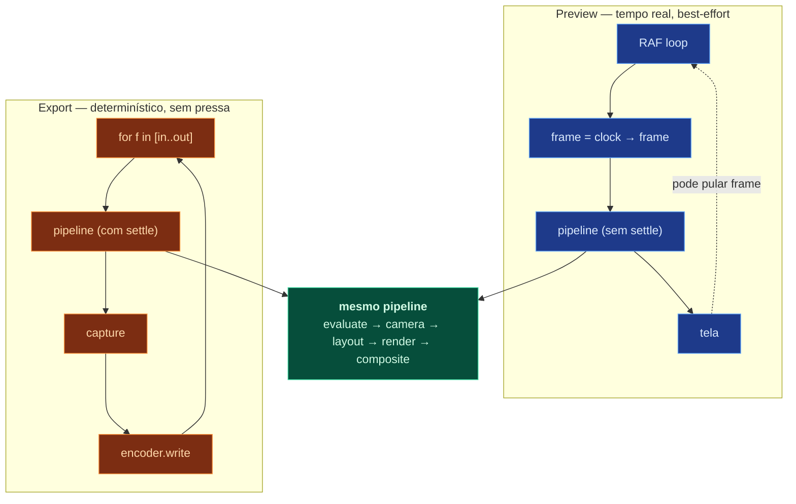
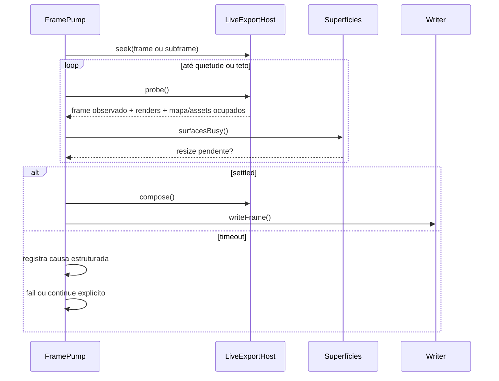
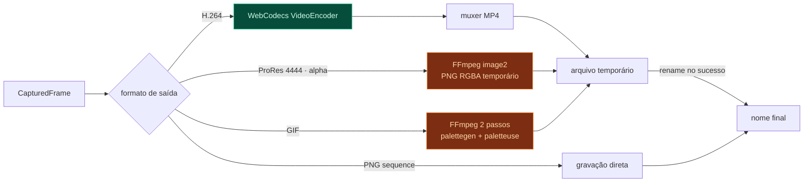

# 06 — Pipeline de renderização

Como um frame vira pixels, e como esses pixels viram arquivo de vídeo.

> **Estado em 2026-07-30:** o export usa as superfícies vivas do editor,
> redimensionadas temporariamente, e não uma BrowserWindow oculta. Settle
> fail-closed, publicação atômica, fila persistente, checkpoints, resolução até
> o teto de 8192 px e supersampling estão implementados. Os ensaios integrados de
> 90 s em 4K/60 e do caminho 8K na máquina-alvo ainda não foram concluídos.

---

## 1. Duas execuções, um pipeline



Diferenças conceituais relevantes:

|                     | Preview              | Export                |
| ------------------- | -------------------- | --------------------- |
| Origem do frame     | relógio real         | contador              |
| Settle do mapa      | não espera           | espera, obrigatório   |
| Frames pulados      | sim, se atrasar      | nunca                 |
| Resolução           | viewport             | resolução de saída    |
| Slot `ui-overlay`   | incluído             | **excluído**          |
| Qualidade de efeito | pode reduzir (proxy) | máxima                |
| Motion blur         | desligado            | conforme configuração |

O export reaproveita a composição e as superfícies do viewport vivo, mas controla
explicitamente frame, tamanho, settle, captura e publicação. A fila executa um
job por vez e restaura a composição que estava selecionada ao terminar.

---

## 2. Etapas em detalhe

### 2.1 Evaluate (puro)

```ts
const scene = evaluate(doc, compositionId, frame);
```

Sem GPU, sem DOM, sem mapa. Roda em Node. Sequência interna:

1. Filtra nós por `timeRange` e `enabled` (e por `solo`, se houver algum).
2. Aplica `timeRemap` — o tempo interno do nó pode diferir do tempo da composição.
3. Avalia propriedades: keyframes → valor base interpolado.
4. Aplica a expressão segura da propriedade, quando existe, sobre `value` e
   `frame`.
5. Se uma expressão falha, conserva o valor base e registra diagnóstico
   estruturado na cena avaliada.
6. Expande Actions em modo `live` → nós sintéticos com IDs derivados por hash.
7. Aplica Behaviors — motion-path escreve em `anchor` e `rotation`.
8. Acumula opacidade pela hierarquia, calcula matrizes locais.
9. Achata a árvore em `drawOrder`.

**Custo alvo:** < 2 ms para 500 nós. Cache por `(nodeId, propertyPath, frame)`
invalidado por patch. Em scrub, a maioria dos nós não muda entre frames adjacentes.

### 2.2 Camera apply

```ts
camera.apply(scene.camera, "jump");
```

O estado autoritativo é `composition.camera`, avaliado no playhead. Aplicá-lo ao
MapLibre é uma sincronização programática protegida contra feedback. Gestos de
usuário podem usar interação/ease visual, mas só o estado consolidado volta ao
documento pelo Command Bus. Em export, sempre `jump`: `easeTo` depende do relógio
real e colocaria a câmera na posição errada.

### 2.3 Settle (só export)

Ver § 4 — é o problema não óbvio deste pipeline.

### 2.4 Projector snapshot

```ts
const proj = camera.projector().snapshot();
```

Congela a matriz de projeção do MapLibre. A partir daqui, nada que aconteça no
mapa (um tile terminando de carregar, um worker devolvendo geometria) pode mover
um objeto do overlay no meio do layout.

### 2.5 Layout

```ts
const screen = layout(scene, proj, { size, pixelRatio });
```

`EvaluatedScene` (geo + comp, abstrato) → `ScreenScene` (pixels).
Resolve anchor, tamanho, rotação e culling. Ver
[03-DATA-MODEL.md § 3](03-DATA-MODEL.md#3-espaços-de-coordenadas).

Culling é por bounds contra o viewport com margem. Uma cena com 300 unidades onde
20 estão visíveis desenha 20.

### 2.6 Render por slot

```ts
renderer.render(screen, ["scene", "above-all"]);
```

Cada slot é um render target próprio. Dentro do slot, `drawOrder` decide.

### 2.7 Effects

Filtros rodam sobre o render target do slot. Partículas são desenhadas com o
frame como uniform — o vertex shader resolve a posição analiticamente:

```glsl
// Vertex shader de partícula — determinístico, sem estado
attribute float aIndex;
uniform float uFrame;
uniform float uSeed;
uniform float uLifetime;

void main() {
  vec4 r = hash4(aIndex, uSeed);            // aleatoriedade reproduzível
  float birth = aIndex / uEmissionRate;
  float tau = uFrame - birth;
  if (tau < 0.0 || tau > uLifetime) { gl_Position = vec4(2.0); return; }  // descarta

  vec2 v0 = vec2(cos(r.x * TAU), sin(r.x * TAU)) * (uSpeed * (0.5 + r.y));
  vec2 pos = uOrigin + v0 * tau + 0.5 * uGravity * tau * tau;
  ...
}
```

Consequências de partículas analíticas: custo de CPU zero, scrub para trás
funciona (não há estado a rebobinar), e o export é bit-exato. Uma explosão de
5.000 partículas custa um único draw call.

### 2.8 Composite

```ts
compositor.composite(
  mode === "export"
    ? ["below-labels", "scene", "above-all"]
    : ["below-labels", "scene", "above-all", "ui-overlay"],
);
```

O slot de UI simplesmente não entra na lista do export. Não existe condicional
dentro do renderer decidindo se desenha gizmo — a lista de slots é o mecanismo.
Impossível vazar interface para o vídeo.

---

## 3. Composição mapa + overlay

Decisão registrada em [ADR-002](adr/ADR-002-compositor.md).

```
┌─────────────────────────────────────────────┐
│  canvas: ui-overlay    (Pixi · só preview)  │  gizmos, guias, seleção
├─────────────────────────────────────────────┤
│  canvas: overlay       (Pixi)               │  slots scene + above-all
├─────────────────────────────────────────────┤
│  canvas: maplibre      (MapLibre WebGL)     │  base, relevo, rótulos
└─────────────────────────────────────────────┘
         empilhados por CSS · mesmo tamanho · mesmo pixelRatio
```

Fases 1–10: canvases empilhados. Simples, robusto, sem compartilhamento de
contexto GL.

Fase 11 (opcional): slot `below-labels` via `CustomLayer` do MapLibre, para
colocar áreas de controle **abaixo** dos rótulos do mapa. Exige compartilhar o
contexto WebGL — risco real, ganho estético. Isolado atrás da interface
`Compositor`; o produto é completo sem isso.

Sincronização entre os canvases:

```ts
map.on("move", () => {
  overlay.needsRedraw = true;
});
map.on("render", () => {
  if (overlay.needsRedraw) redrawOverlay();
});
```

O overlay redesenha **no mesmo tick** que o mapa. Redesenhar em um RAF separado
produziria um frame de defasagem visível como "objetos escorregando" durante pan
rápido — sintoma clássico de overlay mal sincronizado.

---

## 4. Determinismo e settle do mapa

O problema central do export.

MapLibre é assíncrono por natureza: pede tiles, recebe quando recebe, desenha o
que tem. Em uso interativo isso é correto. Em export é inaceitável — um frame com
tile faltando é um frame perdido no meio do vídeo.



### Condições de settle

O host só entra em quietude quando todas valem por uma janela contínua:

1. o frame observado é exatamente o frame ou subframe pedido;
2. o mapa não relata trabalho pendente para a vista atual;
3. nenhum asset ainda está carregando ou sendo decodificado;
4. as superfícies terminaram o redimensionamento;
5. o contador de renders não mudou durante a janela de quietude.

O probe de mapa encapsula os sinais concretos do MapLibre usados pelo viewport.
O pump não assume que `isStyleLoaded()` sozinho significa pixels prontos: estilo
carregado, tiles/labels e repaint da vista são estados diferentes. Assets têm um
teto maior que a quietude comum para permitir o primeiro parse legítimo de um
GLB sem tornar todo frame lento.

### `settlePolicy`

```ts
type SettlePolicy = "fail" | "continue";
```

- `fail` é o padrão. No primeiro timeout, o pump registra a causa e encerra sem
  compor nem escrever aquele frame.
- `continue` precisa ser pedido explicitamente e existe para diagnóstico; compõe
  o estado disponível e mantém a falha no relatório.

As causas atuais são `map-busy`, `assets-busy`, `surfaces-busy`,
`frame-mismatch` e `repaint-timeout`. Não existem políticas de retry ou de
reutilizar o frame anterior.

### Regras de determinismo

Invariantes verificados por lint (`no-nondeterminism`) e por teste de golden frame.

| #   | Regra                                                                        | Motivo                                                   |
| --- | ---------------------------------------------------------------------------- | -------------------------------------------------------- |
| D1  | Proibido `Date.now()`, `performance.now()`, `new Date()` em pacotes de motor | Tempo real vaza no resultado                             |
| D2  | Proibido `Math.random()` em todo o projeto                                   | Use `createRng(seed)`                                    |
| D3  | Toda semente deriva de `hashSeed(comp.seed, nodeId, ...)`                    | Reproduzível e estável                                   |
| D4  | Sem estado acumulado entre frames em `evaluate` ou efeito                    | Permite avaliar frame arbitrário                         |
| D5  | `map.fadeDuration = 0` no render                                             | Cross-fade de rótulo depende de tempo real               |
| D6  | Sem `prefers-reduced-motion`, sem media query no render                      | Ambiente vaza no resultado                               |
| D7  | Ordem de iteração explícita (nunca ordem de chave de objeto)                 | Ordem de `Object.keys` não é garantida em todos os casos |
| D8  | Fontes carregadas antes do frame 0, nunca sob demanda                        | Fallback de fonte muda métrica de texto                  |

**Teste de determinismo** (roda no CI local): renderiza os frames 0, 137, 900 de
um projeto fixture, duas vezes, em ordens diferentes (sequencial e aleatória),
e compara os hashes. Divergência = falha de build.

D8 é o tipo de detalhe que só morde depois: uma fonte que carrega no frame 40
muda a largura do texto e faz o título "pular" no meio do vídeo.

---

## 5. Captura de frame

Três caminhos, por ordem de preferência.

| Método                          | Custo               | Alpha    | Uso                           |
| ------------------------------- | ------------------- | -------- | ----------------------------- |
| `new VideoFrame(canvas)`        | ~0 (zero-copy)      | limitado | WebCodecs — caminho principal |
| `gl.readPixels` → `ArrayBuffer` | alto (stall de GPU) | sim      | FFmpeg rawvideo, PNG          |
| `canvas.toBlob("image/png")`    | médio               | sim      | PNG sequence                  |

`readPixels` sincroniza CPU e GPU e domina o tempo de export. Mitigações:

1. Preferir WebCodecs sempre que o formato permitir — o `VideoFrame` sai do canvas
   sem readback.
2. Quando `readPixels` é inevitável, usar pool de buffers e ping-pong entre dois
   render targets: lê o frame `n−1` enquanto desenha o frame `n`.
3. Buffers de pool, nunca `new Uint8Array` por frame. 5400 frames × 33 MB em 4K
   geraria pressão de GC catastrófica.

```ts
interface CapturedFrame {
  readonly frame: Frame;
  readonly kind: "video-frame" | "rgba-buffer" | "png-blob";
  readonly data: VideoFrame | Uint8Array | Blob;
  readonly size: Vec2;
  release(): void; // devolve ao pool — obrigatório
}
```

`release()` obrigatório: em modo dev, um frame não liberado gera aviso no fim do job.

---

## 6. Alta resolução

O plano separa três tamanhos que não podem ser confundidos:

```ts
layout = [composition.width, composition.height];
output = even(layout * scale);
renderPixelRatio = scale * supersampling;
render = layout * renderPixelRatio;
```

`scale` muda o arquivo final; `supersampling` só aumenta a superfície interna e
depois reduz por box determinístico. Uma composição 1920×1080 com escala 4
produz 7680×4320. Com SS 2, porém, pediria 15360×8640 e seria recusada pelo teto
atual.

O teto padrão é 8192 px por eixo, e as escalas oferecidas são 0,5×, 1×, 2× e
4×. O preflight não reduz silenciosamente: recusa se o tamanho interno passar do
teto ou se MapLibre/Pixi/Three na GPU concreta não confirmarem a superfície.
Assim, “suporta 8K” significa que a conta e a preparação aceitam 7680×4320
quando o hardware comporta; não é evidência de que toda máquina completou o
ensaio integrado. Ver
[ADR-034](adr/ADR-034-direct-8k-with-conformance-guard.md).

Posições em espaço `comp` continuam resolution-independent. O layout lógico não
muda quando a escala da saída muda.

### Fallback: render em tiles

Render em tiles ainda não está implementado. Pedidos acima do teto falham com
mensagem clara. Uma implementação futura precisa resolver a colocação de rótulos
do MapLibre nas costuras; simplesmente dividir o viewport pode duplicá-los ou
omiti-los.

---

## 7. Codificação



| Alvo          | Encoder         | Container | Alpha    | Nota                                       |
| ------------- | --------------- | --------- | -------- | ------------------------------------------ |
| H.264         | WebCodecs       | MP4       | não      | Stream direto; retomada reinicia o arquivo |
| ProRes 4444   | FFmpeg image2   | MOV       | **sim**  | Finaliza a sequência PNG de staging        |
| Sequência PNG | writer próprio  | —         | opcional | Retomável por frame                        |
| GIF           | FFmpeg 2 passos | GIF       | binário  | Finaliza a sequência inteira               |

HEVC, VP9, AV1 e fallback automático de H.264 por FFmpeg não fazem parte do
conjunto de saída implementado nesta versão.

FFmpeg é **sidecar empacotado**, invocado por caminho absoluto resolvido em
runtime quando a distribuição foi preparada. GIF e ProRes recebem uma sequência
PNG determinística numa pasta privada do job; a pasta é removida somente depois
de o arquivo final ser codificado e publicado. Em falha, os frames ficam
preservados para diagnóstico e retomada.

```
ffmpeg -y
  -framerate 60 -i frame_%04d.png
  -c:v prores_ks -profile:v 4 -pix_fmt yuva444p10le -alpha_bits 16
  saida.mov
```

### Alpha channel

Alpha e mapa base são mutuamente exclusivos — um mapa opaco não tem transparência
para exportar. O modo alpha portanto:

1. Exclui estruturalmente o canvas do mapa no compositor de export
2. Compõe apenas palco visível e overlay
3. É explícito nos formatos ProRes 4444 e sequência PNG alfa
4. Preserva RGBA até o PNG ou o perfil 4444 do ProRes

O fundo em xadrez no preview ainda é item de polimento; ele não afeta os pixels
exportados.

O objetivo é usar o vídeo com alpha sobre outra base no NLE, ou sobre um render de
mapa separado. É modo explícito na UI, não um checkbox escondido.

### Publicação atômica

MP4, GIF e MOV nunca são escritos diretamente no nome final. O shell reserva um
temporário `.theatrum-<id>-<nome>` no mesmo diretório e só o renomeia depois de
settle, encoder/muxer e todas as escritas terminarem. Cancelamento ou falha remove
o parcial quando possível; falha de remoção ou de publicação informa o caminho
preservado. Ver
[ADR-027](adr/ADR-027-fail-closed-and-atomic-export.md).

---

## 8. Fila de render

```ts
interface RenderQueueJob {
  id: string;
  compositionId: string;
  compositionName: string;
  options: QueuedExportOptions;
  status: "pending" | "running" | "paused" | "done" | "failed";
  checkpoint?: {
    completedFrames: number;
    totalFrames: number;
    directory: string;
    framesDirectory?: string;
  };
}
```

A fila é persistida no `localStorage` do renderer e executa serialmente no único
viewport vivo. Para cada job, o controlador seleciona a composição pedida,
executa o export e depois restaura a seleção anterior. Um processo encerrado não
deixa job eternamente `running`: ao reabrir, ele aparece `paused` e precisa ser
retomado.

Isso também declara duas limitações:

- o job guarda ID e opções, não um snapshot imutável do documento; editar o
  projeto durante o job ativo o interrompe;
- depois de reiniciar, o projeto e a composição referenciados ainda precisam
  estar disponíveis para a retomada.

A Render Window oculta foi recusada pelo
[ADR-022](adr/ADR-022-export-resolution-from-composition.md); não faz parte da
implementação atual.

### Checkpointing

A execução emite checkpoint periódico (300 frames por padrão) e também ao
abortar/falhar. A fila persiste frames concluídos, total, diretório de saída e,
quando aplicável, a pasta da sequência.

- PNG normal/alfa continua do próximo frame pendente.
- GIF e ProRes reutilizam a sequência PNG e então refazem a etapa final de
  codificação do arquivo único.
- MP4 H.264 é um stream direto e não possui estado de muxer retomável; ao retomar,
  reinicia desde o primeiro frame.

O contrato durável e suas limitações estão no
[ADR-033](adr/ADR-033-durable-render-queue-checkpoints.md).

### Relatório

O relatório mantém frames escritos, falhas e causas de settle, tempo total e p99
de settle. Em política `fail`, `settleFailed > 0` torna o job malsucedido e
impede publicação do arquivo único.

---

## 9. Motion blur

Sampling temporal: renderiza N subframes por frame e acumula.

```
frame f, shutter 180°, samples 8:
  janela: f − 0.25 … f + 0.25
  subframes: pontos médios de 8 faixas uniformes da janela
  settle + composite + box espacial em cada subframe
  acumula RGBA8 sRGB pré-multiplicado em Float32Array
  resolve alfa e canais com arredondamento half-up
```

Custo: N× o tempo de render. Só em export, nunca em preview.

Requisito: `evaluate()` precisa aceitar frame **fracionário**. É o único lugar
onde tempo não-inteiro é válido — e a razão pela qual a assinatura é
`evaluate(doc, id, frame: number)` e não `frame: Frame` estrito.

Motion blur não se aplica ao mapa base (o MapLibre renderiza um estado por vez).
Blur de câmera rápida sobre o mapa exigiria abordagem diferente (blur direcional
pós-processo por vetor de velocidade da câmera) — registrado como possibilidade
futura, não escopo. A acumulação lê o composto final: com câmera estática o mapa
se repete e fica nítido; uma troca rápida de estado do mapa dentro do obturador
também seria mesclada e continua sendo um caso não suportado.

---

## 10. Orçamentos de performance

Metas arquiteturais. Parte delas possui benchmark automatizado, mas esta tabela
não equivale a uma validação final executada nesta árvore. O aceite da Fase 11
exige medir cada cenário aplicável e registrar ambiente e resultado.

| Operação               | Alvo           | Cenário                                 |
| ---------------------- | -------------- | --------------------------------------- |
| `evaluate`             | < 2 ms         | 500 nós, 5000 keyframes                 |
| Layout                 | < 1 ms         | 500 nós                                 |
| Render de overlay      | < 8 ms         | 300 sprites, 2 filtros, 1080p           |
| Frame de preview total | < 16,6 ms      | 1080p, cena típica → 60 fps             |
| Scrub                  | < 33 ms        | resposta a arrastar o playhead → 30 fps |
| Redraw da timeline     | < 4 ms         | 200 trilhas, 3000 keyframes visíveis    |
| Settle do mapa         | < 100 ms (p50) | tiles locais em SSD                     |
| Frame de export 4K     | < 250 ms       | inclui settle e encode                  |
| Abrir projeto          | < 800 ms       | 50 MB, 500 nós                          |
| Undo                   | < 5 ms         | qualquer comando                        |

### Modo proxy (preview)

Este é o comportamento planejado, ainda não implementado como modo completo.
Quando entrar, a degradação deverá ser **explícita e visível na UI**:

1. Metade da resolução (`pixelRatio: 0.5`)
2. Contagem de partículas reduzida a 25%
3. Filtros pesados desligados (blur, glow)
4. Terreno desligado

O export ignora tudo isso. Um indicador no viewport mostra "Proxy 1/2" — porque
um preview degradado silenciosamente faz o usuário ajustar a animação errada.

## 11. Artefatos derivados de preview

A Fase 11 já fornece os núcleos definidos no
[ADR-031](adr/ADR-031-preview-cache-and-reference-audio.md):

- cache de frames em RAM com LRU por bytes, cópia defensiva e CRC32;
- cache em disco sobre uma porta de storage, com inventário e evicção
  determinísticos;
- chave canônica por composição, fingerprint/revisão, frame, resolução e escala;
- análise de PCM intercalado em buckets exatamente alinhados aos frames, com
  mínimo, máximo, pico e RMS.

Esses módulos ainda não estão ligados a uma barra verde de pré-render nem a uma
trilha de waveform na timeline. Áudio é apenas referência derivada: não há
reprodução, scrub sonoro, ganho, fades, mixagem ou inclusão no export.
