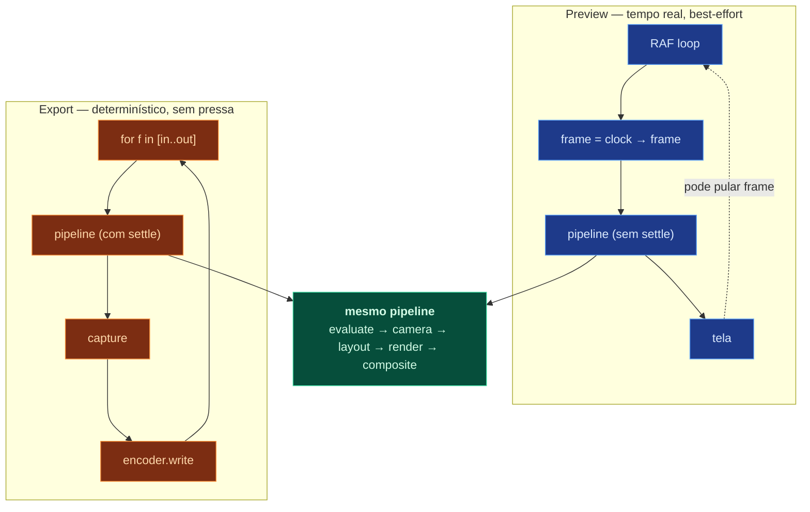
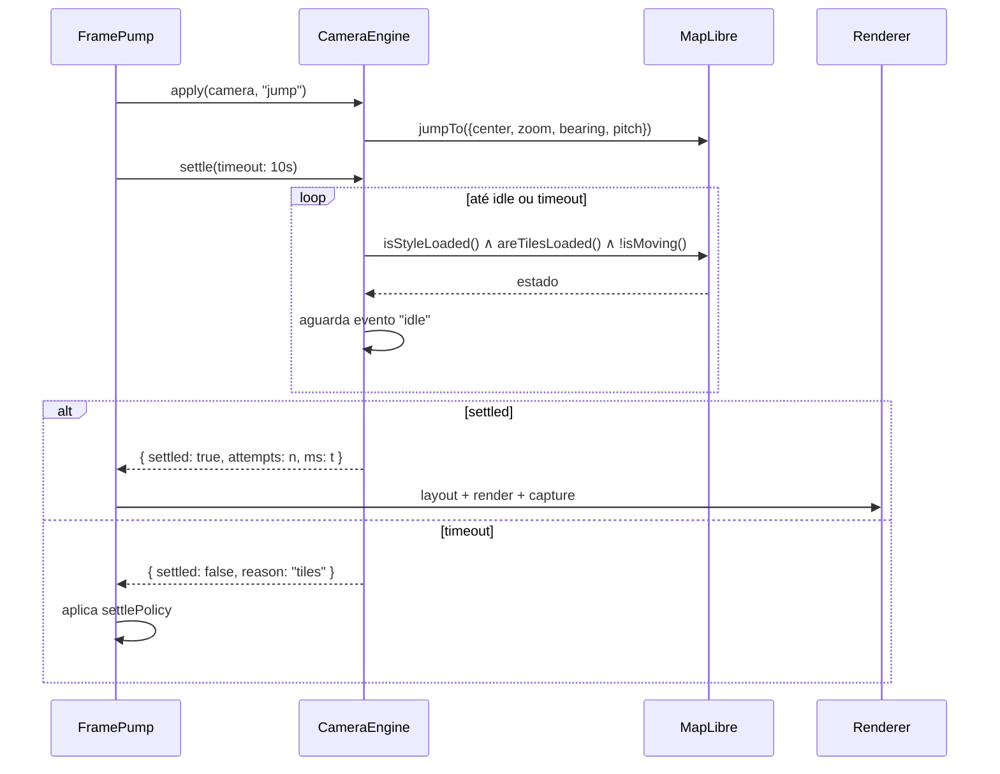
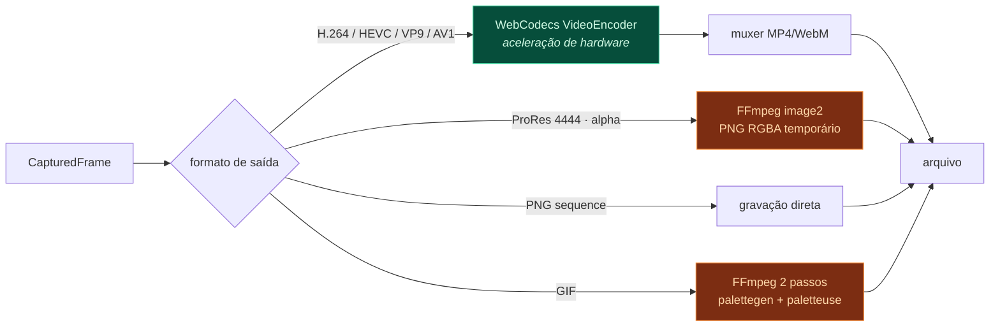

# 06 — Pipeline de renderização

Como um frame vira pixels, e como esses pixels viram arquivo de vídeo.

---

## 1. Duas execuções, um pipeline



Diferenças — e **apenas** estas:

|                     | Preview              | Export                |
| ------------------- | -------------------- | --------------------- |
| Origem do frame     | relógio real         | contador              |
| Settle do mapa      | não espera           | espera, obrigatório   |
| Frames pulados      | sim, se atrasar      | nunca                 |
| Resolução           | viewport             | resolução de saída    |
| Slot `ui-overlay`   | incluído             | **excluído**          |
| Qualidade de efeito | pode reduzir (proxy) | máxima                |
| Motion blur         | desligado            | conforme configuração |

Se preview e export usassem pipelines diferentes, divergiriam — e a divergência
só apareceria depois de 40 minutos de render. Um pipeline, dois modos.

---

## 2. Etapas em detalhe

### 2.1 Evaluate (puro)

```ts
const scene = evaluate(doc, compositionId, frame);
```

Sem GPU, sem DOM, sem mapa. Roda em Node. Sequência interna:

1. Filtra nós por `timeRange` e `enabled` (e por `solo`, se houver algum).
2. Aplica `timeRemap` — o tempo interno do nó pode diferir do tempo da composição.
3. Avalia propriedades: keyframes → valores, via interpolação temporal.
4. Expande Actions em modo `live` → nós sintéticos com IDs derivados por hash.
5. Aplica Behaviors — motion-path escreve em `anchor` e `rotation`.
6. Acumula opacidade pela hierarquia, calcula matrizes locais.
7. Achata a árvore em `drawOrder`.

**Custo alvo:** < 2 ms para 500 nós. Cache por `(nodeId, propertyPath, frame)`
invalidado por patch. Em scrub, a maioria dos nós não muda entre frames adjacentes.

### 2.2 Camera apply

```ts
camera.apply(scene.camera, mode === "export" ? "jump" : "ease");
```

Em export, sempre `jump`. `easeTo` do MapLibre anima em tempo real por conta
própria — usá-lo no export colocaria a câmera na posição errada.

### 2.3 Settle (só export)

Ver § 4 — é o problema não óbvio deste pipeline.

### 2.4 Projector snapshot

```ts
const proj = camera.projector().snapshot();
```

Congela a matriz de projeção do MapLibre. A partir daqui, nada que aconteça no
mapa (um tile terminando de carregar, um worker devolvendo geometria) pode mover
um objeto do overlay no meio do layout.

### 2.5 Layout

```ts
const screen = layout(scene, proj, { size, pixelRatio });
```

`EvaluatedScene` (geo + comp, abstrato) → `ScreenScene` (pixels).
Resolve anchor, tamanho, rotação e culling. Ver
[03-DATA-MODEL.md § 3](03-DATA-MODEL.md#3-espaços-de-coordenadas).

Culling é por bounds contra o viewport com margem. Uma cena com 300 unidades onde
20 estão visíveis desenha 20.

### 2.6 Render por slot

```ts
renderer.render(screen, ["scene", "above-all"]);
```

Cada slot é um render target próprio. Dentro do slot, `drawOrder` decide.

### 2.7 Effects

Filtros rodam sobre o render target do slot. Partículas são desenhadas com o
frame como uniform — o vertex shader resolve a posição analiticamente:

```glsl
// Vertex shader de partícula — determinístico, sem estado
attribute float aIndex;
uniform float uFrame;
uniform float uSeed;
uniform float uLifetime;

void main() {
  vec4 r = hash4(aIndex, uSeed);            // aleatoriedade reproduzível
  float birth = aIndex / uEmissionRate;
  float tau = uFrame - birth;
  if (tau < 0.0 || tau > uLifetime) { gl_Position = vec4(2.0); return; }  // descarta

  vec2 v0 = vec2(cos(r.x * TAU), sin(r.x * TAU)) * (uSpeed * (0.5 + r.y));
  vec2 pos = uOrigin + v0 * tau + 0.5 * uGravity * tau * tau;
  ...
}
```

Consequências de partículas analíticas: custo de CPU zero, scrub para trás
funciona (não há estado a rebobinar), e o export é bit-exato. Uma explosão de
5.000 partículas custa um único draw call.

### 2.8 Composite

```ts
compositor.composite(
  mode === "export"
    ? ["below-labels", "scene", "above-all"]
    : ["below-labels", "scene", "above-all", "ui-overlay"],
);
```

O slot de UI simplesmente não entra na lista do export. Não existe condicional
dentro do renderer decidindo se desenha gizmo — a lista de slots é o mecanismo.
Impossível vazar interface para o vídeo.

---

## 3. Composição mapa + overlay

Decisão registrada em [ADR-002](adr/ADR-002-compositor.md).

```
┌─────────────────────────────────────────────┐
│  canvas: ui-overlay    (Pixi · só preview)  │  gizmos, guias, seleção
├─────────────────────────────────────────────┤
│  canvas: overlay       (Pixi)               │  slots scene + above-all
├─────────────────────────────────────────────┤
│  canvas: maplibre      (MapLibre WebGL)     │  base, relevo, rótulos
└─────────────────────────────────────────────┘
         empilhados por CSS · mesmo tamanho · mesmo pixelRatio
```

Fases 1–10: canvases empilhados. Simples, robusto, sem compartilhamento de
contexto GL.

Fase 11 (opcional): slot `below-labels` via `CustomLayer` do MapLibre, para
colocar áreas de controle **abaixo** dos rótulos do mapa. Exige compartilhar o
contexto WebGL — risco real, ganho estético. Isolado atrás da interface
`Compositor`; o produto é completo sem isso.

Sincronização entre os canvases:

```ts
map.on("move", () => {
  overlay.needsRedraw = true;
});
map.on("render", () => {
  if (overlay.needsRedraw) redrawOverlay();
});
```

O overlay redesenha **no mesmo tick** que o mapa. Redesenhar em um RAF separado
produziria um frame de defasagem visível como "objetos escorregando" durante pan
rápido — sintoma clássico de overlay mal sincronizado.

---

## 4. Determinismo e settle do mapa

O problema central do export.

MapLibre é assíncrono por natureza: pede tiles, recebe quando recebe, desenha o
que tem. Em uso interativo isso é correto. Em export é inaceitável — um frame com
tile faltando é um frame perdido no meio do vídeo.



### Condições de settle

Todas precisam valer:

1. `map.isStyleLoaded()` — estilo processado
2. `map.areTilesLoaded()` — tiles do viewport presentes
3. `!map.isMoving()` — sem transição pendente
4. Glyphs das fontes em uso carregados
5. Sprite atlas carregado
6. Terreno (se ativo) com DEM do viewport carregado
7. Evento `idle` emitido **após** o último `jumpTo`

A condição 7 exige contador de geração: um `idle` que chegou de um `jumpTo`
anterior não conta. Sem isso, o settle "passa" com a câmera do frame anterior —
um bug sutil que produziria arrasto na imagem.

### `settlePolicy`

```ts
type SettlePolicy =
  | { on: "timeout"; action: "fail" } // aborta o job — padrão para entrega final
  | { on: "timeout"; action: "accept" } // aceita o frame, registra no relatório
  | { on: "timeout"; action: "retry"; max: 3 } // tenta de novo
  | { on: "timeout"; action: "reuse-previous" }; // repete o frame anterior
```

Padrão: `retry: 3` e depois `fail`. Melhor abortar em 12% do que descobrir um
frame quebrado depois de publicar.

O relatório final lista tempo de settle por frame. Um export com 3 frames em
`accept` é detectável antes da publicação.

### Regras de determinismo

Invariantes verificados por lint (`no-nondeterminism`) e por teste de golden frame.

| #   | Regra                                                                        | Motivo                                                   |
| --- | ---------------------------------------------------------------------------- | -------------------------------------------------------- |
| D1  | Proibido `Date.now()`, `performance.now()`, `new Date()` em pacotes de motor | Tempo real vaza no resultado                             |
| D2  | Proibido `Math.random()` em todo o projeto                                   | Use `createRng(seed)`                                    |
| D3  | Toda semente deriva de `hashSeed(comp.seed, nodeId, ...)`                    | Reproduzível e estável                                   |
| D4  | Sem estado acumulado entre frames em `evaluate` ou efeito                    | Permite avaliar frame arbitrário                         |
| D5  | `map.fadeDuration = 0` no render                                             | Cross-fade de rótulo depende de tempo real               |
| D6  | Sem `prefers-reduced-motion`, sem media query no render                      | Ambiente vaza no resultado                               |
| D7  | Ordem de iteração explícita (nunca ordem de chave de objeto)                 | Ordem de `Object.keys` não é garantida em todos os casos |
| D8  | Fontes carregadas antes do frame 0, nunca sob demanda                        | Fallback de fonte muda métrica de texto                  |

**Teste de determinismo** (roda no CI local): renderiza os frames 0, 137, 900 de
um projeto fixture, duas vezes, em ordens diferentes (sequencial e aleatória),
e compara os hashes. Divergência = falha de build.

D8 é o tipo de detalhe que só morde depois: uma fonte que carrega no frame 40
muda a largura do texto e faz o título "pular" no meio do vídeo.

---

## 5. Captura de frame

Três caminhos, por ordem de preferência.

| Método                          | Custo               | Alpha    | Uso                           |
| ------------------------------- | ------------------- | -------- | ----------------------------- |
| `new VideoFrame(canvas)`        | ~0 (zero-copy)      | limitado | WebCodecs — caminho principal |
| `gl.readPixels` → `ArrayBuffer` | alto (stall de GPU) | sim      | FFmpeg rawvideo, PNG          |
| `canvas.toBlob("image/png")`    | médio               | sim      | PNG sequence                  |

`readPixels` sincroniza CPU e GPU e domina o tempo de export. Mitigações:

1. Preferir WebCodecs sempre que o formato permitir — o `VideoFrame` sai do canvas
   sem readback.
2. Quando `readPixels` é inevitável, usar pool de buffers e ping-pong entre dois
   render targets: lê o frame `n−1` enquanto desenha o frame `n`.
3. Buffers de pool, nunca `new Uint8Array` por frame. 5400 frames × 33 MB em 4K
   geraria pressão de GC catastrófica.

```ts
interface CapturedFrame {
  readonly frame: Frame;
  readonly kind: "video-frame" | "rgba-buffer" | "png-blob";
  readonly data: VideoFrame | Uint8Array | Blob;
  readonly size: Vec2;
  release(): void; // devolve ao pool — obrigatório
}
```

`release()` obrigatório: em modo dev, um frame não liberado gera aviso no fim do job.

---

## 6. Alta resolução

### 4K — direto

Canvas de 3840×2160, `pixelRatio: 1`. MapLibre pede tiles na resolução adequada.

### 8K — `pixelRatio: 2`

Canvas de 3840×2160 com `pixelRatio: 2` → framebuffer efetivo de 7680×4320.

Por que não canvas de 7680×4320 diretamente: limites de `MAX_RENDERBUFFER_SIZE`
(frequentemente 8192, às vezes 4096) e de área de canvas do Chromium. Com
`pixelRatio`, o MapLibre pede tiles de zoom maior e desenha rótulos com o dobro
de densidade — que é exatamente o comportamento desejado.

```ts
// A resolução de referência da composição NÃO muda.
// Layout em espaço `comp` escala por pixelRatio.
renderer.resize([3840, 2160], 2);
```

Consequência importante: posições em espaço `comp` são resolution-independent.
Um título em `[200, 180]` fica no mesmo lugar relativo em 1080p, 4K e 8K.

### Fallback: render em tiles

Se `pixelRatio` não bastar (resolução exótica), dividir o quadro em N×M tiles e
compor. **Ressalva registrada:** o MapLibre decide colocação de rótulo por
viewport — renderizar em tiles pode duplicar ou omitir rótulos nas costuras. Só
usar quando o mapa base estiver invisível (modo alpha), onde o problema não existe.

---

## 7. Codificação



| Alvo         | Encoder         | Container | Alpha   | Nota                                        |
| ------------ | --------------- | --------- | ------- | ------------------------------------------- |
| H.264        | WebCodecs (HW)  | MP4       | não     | Entrega padrão para YouTube                 |
| HEVC / H.265 | WebCodecs (HW)  | MP4       | não     | Depende de suporte do driver                |
| VP9          | WebCodecs       | WebM      | parcial | Alpha em VP9 é irregular                    |
| AV1          | WebCodecs       | MP4/WebM  | não     | Lento em software                           |
| ProRes 4444  | FFmpeg image2   | MOV       | **sim** | Caminho de alpha confiável                  |
| PNG sequence | direto          | —         | **sim** | Sem perda; melhor para composição posterior |
| GIF          | FFmpeg 2 passos | GIF       | binário | Paleta gerada da sequência inteira          |

Detecção de capacidade em runtime via `VideoEncoder.isConfigSupported()`. Se o
hardware não suportar, cai para FFmpeg em software com aviso claro — nunca falha
sem explicar.

FFmpeg é **sidecar empacotado**, invocado por caminho absoluto resolvido em
runtime. Nunca depende do `PATH` do sistema em produção. GIF e ProRes recebem uma
sequência PNG determinística numa pasta privada do job; a pasta é removida
somente depois de o arquivo final ser codificado e hasheado. Em falha, os frames
ficam preservados para diagnóstico e recuperação.

```
ffmpeg -y
  -framerate 60 -i frame_%04d.png
  -c:v prores_ks -profile:v 4 -pix_fmt yuva444p10le -alpha_bits 16
  saida.mov
```

### Alpha channel

Alpha e mapa base são mutuamente exclusivos — um mapa opaco não tem transparência
para exportar. O modo alpha portanto:

1. Exclui estruturalmente o canvas do mapa no compositor de export
2. Compõe apenas palco visível e overlay
3. É explícito nos formatos ProRes 4444 e sequência PNG alfa
4. Preserva RGBA até o PNG ou o perfil 4444 do ProRes

O fundo em xadrez no preview ainda é item de polimento; ele não afeta os pixels
exportados.

O objetivo é usar o vídeo com alpha sobre outra base no NLE, ou sobre um render de
mapa separado. É modo explícito na UI, não um checkbox escondido.

---

## 8. Fila de render

```ts
interface RenderJobSpec {
  compositionId: string;
  range: [Frame, Frame];
  output: OutputSpec;
  resolution: Vec2;
  pixelRatio: number;
  settlePolicy: SettlePolicy;
  motionBlur: MotionBlurSpec | null;
  alpha: boolean;
}
```

A fila roda na **Render Window** (BrowserWindow oculta) com sua própria instância
de `engine` em `mode: "render"`. Motivos em
[01-ARCHITECTURE.md § 7](01-ARCHITECTURE.md#7-processos-electron).

### Checkpointing

A cada 300 frames, grava progresso em `%APPDATA%/Theatrum/jobs/<id>.json`. Um
job interrompido retoma do último checkpoint em vez de reiniciar — relevante
quando um export de 8K leva 3 horas.

### Relatório

```json
{
  "jobId": "job_4a1f",
  "status": "completed",
  "frames": { "total": 5400, "rendered": 5400, "settleFailed": 0, "reused": 0 },
  "timing": { "totalMs": 1284000, "avgFrameMs": 237.8, "avgSettleMs": 61.2, "p99SettleMs": 340 },
  "output": { "path": "D:/render/barbarossa.mov", "bytes": 8412773888 },
  "warnings": []
}
```

`p99SettleMs` alto indica gargalo de disco nos tiles — informação acionável.

---

## 9. Motion blur

Sampling temporal: renderiza N subframes por frame e acumula.

```
frame f, shutter 180°, samples 8:
  subframes: f − 0.25 … f + 0.25 em 8 passos
  acumula em float render target
  divide por 8
```

Custo: N× o tempo de render. Só em export, nunca em preview.

Requisito: `evaluate()` precisa aceitar frame **fracionário**. É o único lugar
onde tempo não-inteiro é válido — e a razão pela qual a assinatura é
`evaluate(doc, id, frame: number)` e não `frame: Frame` estrito.

Motion blur não se aplica ao mapa base (o MapLibre renderiza um estado por vez).
Blur de câmera rápida sobre o mapa exigiria abordagem diferente (blur direcional
pós-processo por vetor de velocidade da câmera) — registrado como possibilidade
futura, não escopo.

---

## 10. Orçamentos de performance

Metas, verificadas por benchmark em `tests/perf/`. Ultrapassar é bug.

| Operação               | Alvo           | Cenário                                 |
| ---------------------- | -------------- | --------------------------------------- |
| `evaluate`             | < 2 ms         | 500 nós, 5000 keyframes                 |
| Layout                 | < 1 ms         | 500 nós                                 |
| Render de overlay      | < 8 ms         | 300 sprites, 2 filtros, 1080p           |
| Frame de preview total | < 16,6 ms      | 1080p, cena típica → 60 fps             |
| Scrub                  | < 33 ms        | resposta a arrastar o playhead → 30 fps |
| Redraw da timeline     | < 4 ms         | 200 trilhas, 3000 keyframes visíveis    |
| Settle do mapa         | < 100 ms (p50) | tiles locais em SSD                     |
| Frame de export 4K     | < 250 ms       | inclui settle e encode                  |
| Abrir projeto          | < 800 ms       | 50 MB, 500 nós                          |
| Undo                   | < 5 ms         | qualquer comando                        |

### Modo proxy (preview)

Quando o preview não sustenta 60 fps, degradação **explícita e visível na UI** —
nunca silenciosa:

1. Metade da resolução (`pixelRatio: 0.5`)
2. Contagem de partículas reduzida a 25%
3. Filtros pesados desligados (blur, glow)
4. Terreno desligado

O export ignora tudo isso. Um indicador no viewport mostra "Proxy 1/2" — porque
um preview degradado silenciosamente faz o usuário ajustar a animação errada.
