# 08 — Roteiro de implementação

Uma fase por vez. Cada fase tem **critério de saída verificável** — não "está
pronto", mas "faz X, comprovadamente". Nenhuma fase começa antes da anterior
passar em `pnpm check`.

A ordem não é arbitrária. Ela segue o risco: o que é difícil de retrofitar vem
primeiro, o que é aditivo vem depois.

```mermaid
gantt
    dateFormat X
    axisFormat %s
    title Sequência de fases (unidade: peso relativo)

    section Base
    F1 Fundação            :f1, 0, 2
    F2 Mapa e Câmera       :f2, after f1, 3
    F3 Documento e Undo    :f3, after f2, 3

    section Editor
    F4 Objetos e Timeline  :f4, after f3, 4
    F5 Animação avançada   :f5, after f4, 4

    section Conteúdo
    F6 Efeitos             :f6, after f5, 4
    F7A Biblioteca assets  :f7a, after f6, 2
    F7B Camadas geo        :f7b, after f7a, 3
    F7C Rotas e setas      :f7c, after f7b, 2
    F7D Textos no mapa     :f7d, after f7c, 1
    F7 Ações               :f7, after f7d, 3

    section Saída
    F8 Exportação          :f8, after f7, 4
    F9 Scene Script / IA   :f9, after f8, 2

    section Extensão
    F10 Plugins e assets   :f10, after f9, 2
    F11 Polimento          :f11, after f10, 3
```

Por que esta ordem:

- **Mapa antes de documento** (F2 antes de F3): a projeção geo↔tela contamina o
  modelo de dados. Descobrir na F3 que `anchor` precisa de `altitude` é barato;
  descobrir na F8 não é.
- **Undo antes de objetos** (F3 antes de F4): se os primeiros 20 comandos forem
  escritos sem o Command Bus, serão reescritos.
- **Exportação antes de Scene Script** (F8 antes de F9): a exportação é o que
  valida o determinismo. Gerar cenas por IA sobre um motor não determinístico é
  construir sobre areia.

---

## Replanejamento — 2026-07-27 · assets importados, não efeitos procedurais

**Decisão do dono do projeto.** Elementos visuais de cena — explosões, tanques,
veículos, elementos 3D — **não são gerados proceduralmente**. O usuário importa
assets prontos (PNG, sprites, modelos). O sistema de partículas da Fase 6 fica
congelado como está: implementado e determinístico, mas **nenhum emissor ou
filtro novo será adicionado**. O que a ferramenta precisa entregar agora é a
biblioteca que recebe esses assets e os sistemas de autoria geopolítica: rotas,
setas, textos, contornos de países e estados, estradas.

As fases antigas mantêm a numeração para não quebrar referências cruzadas nos
outros documentos. Quatro blocos novos entram **antes** da Fase 7 original, na
sequência abaixo. Cada um continua com critério de saída verificável.

### 7A — Biblioteca de ativos (import)

> ✅ **Concluído em 2026-07-27.** Os cinco critérios passam em
> `pnpm verify:phase7a` (Electron real): import com thumbnail na hora, aplicar
> renderiza e anima, round-trip do container preserva o SHA-256 dos bytes,
> remoção em uso avisa os nós afetados e os preserva, 200 assets com thumbnails
> lazy.

**Objetivo.** O usuário traz os próprios assets; a ferramenta guarda, organiza e
aplica. Sai do escopo da Fase 10 e vira o primeiro bloco a ser feito.

Escopo:

- `packages/assets` sai do stub: AssetStore content-addressed (hash do
  conteúdo, como previsto em [04](04-PROJECT-FORMAT.md)), thumbnails, metadados
  (nome, tags livres, dimensões)
- Import de PNG/JPG/WebP/SVG pelo painel Biblioteca (picker e arrastar
  arquivo); GLB/glTF registrado como `kind` para uso futuro no viewport 3D
- Painel Biblioteca real: grid com thumbnails, busca, filtro por tag,
  renomear/remover, contagem de usos
- Aplicar asset → cria nó `image`/`svg` ancorado no centro da vista, via
  Command Bus (desfeito por `Ctrl+Z`)
- Assets persistem dentro do `.theatrum`; reabrir nunca pede caminho de arquivo

**Critério de saída.**

1. Importar um PNG de tanque → thumbnail no painel na hora.
2. Aplicar → nó na cena renderiza a imagem; mover/rotacionar/escalar com os
   gizmos existentes; todas as propriedades animáveis por keyframes.
3. Salvar e reabrir o projeto → imagem idêntica, sem arquivo externo.
4. Remover um asset em uso → aviso lista os nós afetados; confirmar troca o
   visual por placeholder `unresolved` sem perder o nó.
5. Importar 200 assets não degrada a abertura do painel (thumbnails lazy).

### 7A+ — Preview 3D no viewport (model3d)

> ✅ **Concluído em 2026-07-27.** Demo end-to-end em `tools/demo-f18.mjs`
> (Electron real): GLB do usuário importado pela Biblioteca, nó `model3d` com
> `motion-path` em rota catmull-rom Kiev→Moscou, marcadores de passagem
> temporizados e destaque de contorno UA/RU — com screenshots de prova em
> `demo-f18/`.

**Objetivo.** Modelos GLB/glTF da Biblioteca aparecem no mapa e seguem os
sistemas existentes (caminhos, keyframes, comportamentos).

Escopo entregue:

- Tipo de nó `model3d` (categoria media): `assetId`, `scaleMeters` (tamanho
  visual em metros de terreno), `altitudeMeters`, `headingOffset` (correção do
  eixo do nariz). `applyAsset` de um `model` cria esse nó
- Camada custom do MapLibre com Three.js (`model3d-layer.ts`), mesmo canvas e
  contexto WebGL do mapa; posição e rumo vêm da cena avaliada (inclusive a
  contribuição do `motion-path` em `geo-bearing`), com sync por frame dirigido
  pelo `SceneOverlay` e repaint sob demanda
- GLTFLoader via `parse` de buffer com **texturas embutidas**: a CSP libera
  `blob:` em `connect-src` (o decodificador do three faz fetch de object URLs);
  sem isso o modelo carrega sem textura nenhuma (malha branca). Modelo
  normalizado para dimensão máxima 1 e reescalado por `scaleMeters`
- Mundo = **pixels mercator no zoom atual**: o `modelViewProjectionMatrix` do
  MapLibre v5 não usa mercator 0..1 (provado pelo `_calcMatrices` do Transform
  e por diagnóstico NDC na camada)
- Iluminação: environment map via `PMREMGenerator` + `RoomEnvironment` (volume
  e reflexos sem HDR externo), tone mapping ACES, preenchimento
  hemisphere+directional moderados; metalness limitado a 0,6. O traverse de
  ajustes (`frustumCulled=false`, `depthTest=false`, clamps) roda DEPOIS do
  `wrapper.add(model)` — rodar antes aplicava tudo no grupo vazio
- Renderer builtins: `model3d` registrado com `noVisual` (o Pixi não desenha)
- **Volume 3D exige `altitudeMeters` + câmera baixa**: com altitude 0 o modelo
  fica colado no terreno e vira "recorte plano" em qualquer pitch — só o topo
  das asas aparece. O demo voa a 90 km; a câmera baixa (ex.: 8 km de altitude,
  pitch ~80°, via `calculateCameraOptionsFromTo` do MapLibre v5 — não há
  `FreeCameraOptions` nesta versão) enxerga o ventre, a fuselagem e as deriva.
  Prova: `demo-f18/voo-chase.png`

Limitações honestas (preview, não export):

- O export determinístico (Fase 8) ainda não captura o 3D — é visual de
  viewport
- Opacidade hierárquica e `visible` por keyframe não se aplicam ao modelo;
  contorno de país do demo é camada de estilo em runtime (a versão documental
  é o bloco 7B)
- Sem teste de profundidade contra o terreno por escolha de design (o modelo é
  overlay, sempre por cima); sem projeção globo

### 7B — Camadas geográficas: contornos, estados, estradas

> 🚧 **Em curso.** Entregue: malha compilada (ADR-009 e ADR-010), leitor,
> catálogo de busca, tipos de nó `geo.region` e `geo.rivers`, o passe que projeta
> a geometria por frame, e o recorte contra a vista.
>
> Verificado no Electron real: o contorno da Ucrânia cai sobre as fronteiras do
> basemap; o nível de detalhe sobe com o zoom; território fora da vista não é
> projetado; e o preenchimento acerta em quatorze pixels medidos em cidades
> conhecidas — Kiev, Lviv, Smolensk e Moscou pintados; Minsk, Vilnius, Varsóvia,
> Bucareste e o Báltico limpos.
>
> **Orçamento resolvido.** Zoom de cidade com um país inteiro na cena custava
> ~16 ms de 16,6. O recorte em graus antes da projeção derrubou para 1,4 ms: a
> Rússia em z13 sobre Kiev sai como quatro cantos da vista em vez de 25 mil
> vértices que ninguém veria. Pior frame medido em qualquer zoom: 5,9 ms.
>
> **Falta:** `geo.roads` (com medição própria, como o ADR-009 exige),
> `area.transfer` em OkLab, painel de seleção de território na UI, e o
> verificador dos quatro critérios.

**Objetivo.** País, estado, rio e estrada viram nós animáveis, não decoração do
basemap.

Escopo:

- `tools/fetch-data.ts` passa a baixar também `admin_1` (estados/províncias) e
  `roads` do Natural Earth; countries/lakes/rivers/places já estão locais
- Tipos de nó novos: `geo.region` (país ou estado, por nome/ISO), `geo.roads`,
  `geo.rivers` — propriedades `fill`, `fillAlpha`, `stroke`, `strokeWidth`,
  `highlight`
- Renderização no overlay Pixi como polígonos (GeoJSON convertido no avaliador,
  com cache por `(geoId, versão)`). Se a malha 10m estourar o orçamento de
  frame, a alternativa declarada é camada MapLibre com `feature-state`
  dirigido pelo engine — decisão medida, não chutada
- Seleção do território por dropdown com busca (gazetteer administrativo)
- `area.transfer` (transição de cor de território em OkLab) sai da Fase 7 e
  entra aqui — é o uso real: mostrar avanço de front

**Critério de saída.**

1. Adicionar "Ucrânia" → contorno correto em qualquer zoom, pitch e bearing.
2. Animar `fill` de um `geo.region` por keyframes → transição suave e
   determinística: scrub para trás produz hash de frame idêntico ao scrub para
   frente.
3. Estradas de um país inteiro na tela sem violar o orçamento de frame do
   overlay.
4. Um `geo.region` aparece no Inspector gerado e aceita os filtros existentes
   (outline, glow).

### 7C — Rotas e setas

**Objetivo.** O instrumento clássico de mapa de guerra: a seta de avanço.

Escopo:

- Tipo de nó `route` que referencia um `path` do projeto (F5) e renderiza a
  linha no overlay: sólida ou tracejada, `dashOffset` animável, largura, cor
- Arrowhead na ponta: tamanho e ângulo seguem o vetor tangente do path no
  ponto final avaliado
- Seta de avanço preenchida ("fat arrow"): polígono ao longo do path, corpo e
  cabeça proporcionais, gerado deterministicamente a partir do path
- Revelação animada: `trim` de 0→1 ao longo do path, com easing normal do
  editor de curvas
- Desenho com a caneta da F5; criar `route` sem path abre a caneta na hora

**Critério de saída.**

1. Desenhar Kursk→Belgorod com a caneta, aplicar seta de avanço e revelar em
   2 s → a cabeça acompanha a ponta da revelação frame a frame.
2. Scrub para trás desfaz a revelação de forma bit-idêntica (hash de frame).
3. Editar um vértice do path atualiza a seta sem recriar o nó.
4. 50 rotas simultâneas dentro do orçamento de frame do overlay.

### 7D — Textos e rótulos no mapa

**Objetivo.** Topônimos, datas e anotações ancorados no terreno.

Escopo:

- `text.title`/`text.label` com âncora geo (a F4 já ancora unidades; aqui é
  ligar o mesmo caminho nos tipos de texto e na UI)
- Criação direta no canvas: duplo clique no mapa → label nasce ancorado no
  ponto, com edição inline
- "Rótulo de lugar": digitar um nome resolve pelo gazetteer (F2) e ancora nas
  coordenadas resolvidas
- Propriedades novas: `halo` para legibilidade sobre o basemap, `maxWidth` com
  quebra de linha

**Critério de saída.**

1. Duplo clique em Kiev → label ancorado; zoom, pitch e rotação mantêm o texto
   no ponto geográfico.
2. Rótulo criado pelo gazetteer aponta para as coordenadas exatas do lugar.
3. Texto com halo continua legível sobre qualquer um dos três estilos de mapa.

**Impacto nas fases antigas.** A Fase 7 (Ações) passa a usar assets importados
da 7A nos templates — `bombard` e `airstrike` referenciam um sprite importado
ou os emissores já implementados, nunca um efeito procedural novo. A Fase 10
perde a biblioteca (virou 7A) e fica com `plugin-host`, símbolos NATO,
bandeiras e paletas. Fases 8, 9 e 11 não mudam.

---

## Fase 1 — Fundação

**Objetivo.** Esqueleto que compila, roda e já impõe as regras de arquitetura.

**Estado: concluída em 2026-07-26.**

Escopo:

- pnpm workspace com todos os pacotes vazios (só `index.ts` e `package.json`)
- `tsconfig.base.json` estrito, project references
- ESLint flat config + Prettier + as 4 regras customizadas de `tools/eslint-rules/`
- `dependency-cruiser` configurado a partir da matriz de dependências
- Electron shell: janela do editor, menu, `contextBridge` tipado
- `dockview` com painéis vazios no layout do After Effects
- Design tokens e primitivos de UI (`Button`, `Panel`, `Field`, `NumberDrag`)
- `core-math`, `core-time`, `core-utils` **completos e testados** (são pequenos e
  não mudam depois)
- Vitest rodando

**Critério de saída.**

1. `pnpm dev` abre a janela com os painéis dockáveis, arrastáveis, com layout
   persistido entre sessões.
2. `pnpm check` verde.
3. Um import proibido (ex.: `document` importando `renderer`) **falha o lint**.
   Testado de propósito.
4. `core-math` e `core-time` com cobertura > 90%, incluindo testes de propriedade
   de arc-length e round-trip de parsing de tempo.

O item 3 é o que garante que a arquitetura sobreviva. Sem verificação automática,
as camadas vazam em duas semanas.

### Evidências de saída

1. No Electron real, o divisor esquerdo foi movido de 264 px para 498 px. A
   janela foi fechada 50 ms depois — antes do debounce normal de 400 ms — e uma
   nova sessão restaurou o divisor em 498 px, os oito painéis e a timeline
   full-width. O layout padrão foi restaurado após o teste.
2. `pnpm check` passa: TypeScript, ESLint, Prettier, dependency-cruiser e 334
   testes.
3. `tools/eslint-rules/rules.test.ts` prova que imports para cima, arestas
   laterais não declaradas, acesso a internals e mutação direta do documento
   falham na configuração real do ESLint.
4. Cobertura V8: 97,78% de linhas no total; `core-math` 97,74%, `core-time`
   97,88% e `core-utils` 97,77%. Inclui propriedades de arc-length e round-trip
   de timecode, inclusive drop-frame.
5. `pnpm build` gera com sucesso main ESM, preload CommonJS sandboxed e renderer.

---

## Fase 2 — Mapa e Câmera

**Objetivo.** Mapa real, offline, navegável, com câmera animável por keyframe.

**Estado: concluída em 2026-07-26.**

Escopo:

- `tools/fetch-data.ts`: baixa e verifica PMTiles Natural Earth, GeoJSON e glyphs
- `pmtiles://` no renderer sobre `theatrum-data://` no main do Electron
- 3 estilos: `dark-relief`, `historical-parchment`, `minimal-political`
- `gis`: `ProjectorPort` sobre o transform do MapLibre, geodesia, gazetteer
- `camera`: modelo, `apply`, `settle`, helpers de enquadramento
- Painel de viewport: pan, zoom, rotação (bearing), inclinação (pitch)
- Keyframes de câmera com interpolação linear (bezier vem na F5)
- Playback simples: play/pause/stop, scrub, loop

**Critério de saída.**

1. Mapa navega com fluidez a 60 fps, **com o cabo de rede desconectado**.
2. Dois keyframes de câmera → animação suave de Varsóvia a Leningrado com
   pan+zoom+pitch simultâneos.
3. `ProjectorPort.project()` de um lng/lat conhecido bate com `map.project()`
   em pitch 0, 45 e 70 — teste automatizado.
4. `settle()` resolve em < 100 ms (p50) com tiles em SSD, e reporta timeout
   corretamente quando o arquivo PMTiles é removido no meio.
5. Gazetteer resolve "Kursk, RU" e reporta ambiguidade em "Springfield".

### Evidências de saída

1. Os três estilos carregaram no Electron real apenas de
   `theatrum-data://local`; a auditoria de Resource Timing encontrou zero URL
   externa durante carga e troca de estilo. O playback mediu 75 fps no monitor
   de teste, acima do orçamento de 60 fps.
2. A trilha de 360 frames chegou exatamente de Varsóvia
   `[21.0122, 52.2297] / z6.15 / pitch 18` a Leningrado
   `[30.3158, 59.9391] / z7.05 / pitch 56`. Play, pause, stop, scrub e loop
   foram exercitados no renderer real.
3. O adapter `ProjectorPort` produziu delta de **0 px** contra `map.project()`
   para Kursk em pitch 0, 45 e 70.
4. Dez mudanças de vista com tiles locais deram p50 de **66,4 ms** para
   `settle()` (máximo 121,1 ms). Ao retirar o PMTiles durante uma nova carga,
   `settle(300)` devolveu `{ settled: false, reason: "timeout" }` em 300,2 ms.
5. O protocolo respondeu Range com `206`, `Content-Range:
bytes 0-126/3829650` e 127 bytes exatos; range impossível respondeu `416`.
   Traversal, host incorreto e método de escrita também foram rejeitados.
6. O gazetteer Natural Earth 10m carregou 7.342 lugares. `"Kursk, RU"` resolveu
   para `[36.190028, 51.73998]`; `"Springfield"` devolveu cinco escolhas
   (Massachusetts, Missouri, Illinois, Ohio e Oregon).
7. `pnpm check` passa com 468 testes. Cobertura V8 total: > 97,3% de linhas;
   `gis` 96,94%, `camera` 94,28% e adapters do viewport 100%.

### Limite deliberado da base inicial

O bootstrap mundial é Natural Earth z0–6 (3,83 MB), adequado para composição
geopolítica global. OpenMapTiles/OSM detalhado, sprites de POI e terreno são
assets incrementais por região; incluí-los no bootstrap global transformaria um
download reprodutível pequeno em dezenas ou centenas de gigabytes. As portas e
o formato PMTiles já permitem adicioná-los sem mudar o motor.

---

## Fase 3 — Documento, Comandos, Undo

**Objetivo.** Fundação de dados. Nada visual, tudo estrutural.

**Estado: concluída em 2026-07-26.**

Escopo:

- `schema`: todos os schemas Zod da v1 + `tools/gen-schema.ts`
- `document`: store com Immer, patches, seletores memoizados, validação, migração
- `commands`: bus, handlers, transações, histórico
- ~30 comandos base: `node.*`, `property.*`, `keyframe.*`, `composition.*`
- `project-io`: `.theatrum` (ZIP), assets por conteúdo, escrita atômica
- Autosave incremental + recuperação de crash
- Painel de projeto (árvore de composições, assets, pastas)
- Painel de histórico estilo After Effects

**Critério de saída.**

1. Criar 50 nós, renomear, reparentar, deletar. `Ctrl+Z` 50 vezes → documento
   idêntico ao inicial (comparação profunda automatizada).
2. Salvar, fechar, reabrir → documento idêntico byte a byte.
3. Salvar o mesmo documento duas vezes → arquivos idênticos byte a byte.
4. Matar o processo com `taskkill` durante edição → ao reabrir, oferece
   recuperação e recupera corretamente.
5. Abrir um projeto com `schemaVersion: 99` → erro claro, sem crash.
6. Uma migração v1→v2 fictícia implementada e testada com fixture.

O item 3 é o que torna o formato versionável e o diff útil.

### Evidências de saída

1. O teste do Command Bus cria 50 nós com rename, reparent e delete em
   transações, desfaz as 50 entradas e compara profundamente o documento com o
   estado inicial. A mesma prova no Electron real levou a árvore de 1 para 51
   nós e de volta a 1, com igualdade exata e painel Histórico sincronizado.
2. A prova em disco salva, reabre e salva novamente um container de 4.264 bytes:
   `project.json` e os dois `.theatrum` são idênticos byte a byte. O gerador de
   schemas também produziu os quatro artefatos duas vezes com SHA-256 idêntico.
3. Após um `taskkill /T /F` durante uma edição real, a nova sessão ofereceu
   recuperação e restaurou o nó `RECOVERY_SENTINEL_F3`, sem alterar o projeto
   original.
4. `schemaVersion: 99` é rejeitado como `future-schema`, com a orientação para
   atualizar o aplicativo, sem derrubar o renderer.
5. A fixture de migração fictícia v1→v2 converte o campo legado, preserva campos
   `$` e payloads opacos e não modifica a entrada.
6. Assets, thumbnails e notas sobrevivem ao ciclo abrir→editar→salvar e também
   ficam protegidos no sidecar da recuperação. Referências `assets/` sem binário
   correspondente são rejeitadas.
7. Autosave, heartbeat, troca de projeto e fechamento limpo são serializados;
   uma edição que chega durante um save continua marcada como não salva e
   recuperável.
8. `pnpm check` passa com 46 arquivos de teste e 535 testes. O
   dependency-cruiser validou 169 módulos e 353 dependências; o build de
   produção gerou main, preload e renderer com sucesso.

---

## Fase 4 — Objetos e Timeline

**Objetivo.** Colocar coisas no mapa e animá-las no tempo.

**Estado: concluída em 2026-07-26.**

Escopo:

- `scene-graph`: registry de tipos, resolução de anchor/size, hierarquia
- `renderer`: Pixi, compositor de slots, ciclo de vida de renderables
- Tipos de nó: `group`, `null`, `text.title`, `text.label`, `image`, `svg`,
  `shape.line`, `shape.polygon`, `symbol.icon`, `unit.armor`, `unit.infantry`
- Transform completo nos dois espaços de coordenadas
- **Painel de timeline em canvas:** trilhas, barras de duração, keyframes,
  playhead, marcadores, zoom, snap
- **Painel de Inspector gerado** a partir de `PropertyDescriptor[]`
- Seleção (clique, marquee, shift), gizmos de transformação no viewport
- Copiar/colar/duplicar, agrupar/desagrupar, pastas

**Critério de saída.**

1. Colocar um tanque em Kursk. Zoom, rotação, pitch → o tanque permanece sobre a
   mesma coordenada, com tamanho de tela constante e apontando para o norte
   correto.
2. Colocar um título em espaço `comp` → não se move com a câmera.
3. Keyframe de opacidade + escala, `play` → animação correta a 60 fps.
4. Timeline com 200 trilhas e 3000 keyframes: scrub a 30 fps, redraw < 4 ms.
5. Adicionar um tipo de nó novo toca **um** arquivo de registro e **um** de
   renderable — comprovado escrevendo `shape.circle` do zero.
6. Inspector mostra as propriedades corretas do tipo novo **sem código de UI**.

O item 5 é o teste real da arquitetura de registry.

### Evidências de saída

Reproduzível com `pnpm dev` em uma janela e `pnpm verify:phase4` em outra. Todas
as medidas abaixo saíram do Electron real, não de jsdom.

1. Um `unit.armor` ancorado em Kursk `[36.190028, 51.73998]` atravessou cinco
   estados de câmera (z5.2 pitch 0; z8.4; bearing 47°; pitch 45° com bearing
   −23°; pitch 70° com bearing 128°). O erro máximo contra `map.project()` foi de
   **2,8 × 10⁻¹⁴ px**, o tamanho de tela ficou constante em 64 × 64 px e o ângulo
   de norte bateu com `bearingToScreenAngle` com erro **0°** — a rotação na tela
   acompanhou o bearing (−47°, 23°, −128°).
2. Um `text.title` em espaço `comp` manteve os mesmos bounds
   (`x 110,22 · y 47,76 · 720 × 120`) nos cinco estados: **0 px** de deslocamento.
3. Keyframes lineares de opacidade (1 → 0,2) e escala (1 → 2) entre os frames 0 e
   60 foram amostrados em 0/15/30/45/60: 1,00/0,80/0,60/0,40/0,20 e
   1,00/1,25/1,50/1,75/2,00, com erro de 5,6 × 10⁻¹⁷ na opacidade e 0 na escala.
   O `play` real rodou a **59,0 fps** de playhead e **59,0 fps de frames de
   overlay efetivamente renderizados** (60 Hz de tela), com custo de frame de
   0,7 ms no p95.
4. Um documento de **300 trilhas e 3.120 keyframes** foi montado por comandos.
   Num painel de 1440 × 900 (tela cheia em 1080p) rolado até a região densa e com
   a duração inteira visível, cada redraw desenhou 41 trilhas e **455 keyframes**
   em **0,2 ms de p50 e 0,4 ms de p95** (máximo de 10,2 ms em uma amostra) — bem
   dentro do orçamento de 4 ms e de 30 fps. O painel real da sessão (222 px de
   altura) ficou em 0,2 ms de p95 com 117 keyframes desenhados. Como teto
   informativo, desenhar as 300 trilhas de uma vez num canvas de 6.624 px de
   altura — altura que nenhuma tela mostra — custa 2,1 ms de p50 e 26,2 ms de
   p95. O culling é o que mantém o custo ligado à área visível, não ao volume de
   dados; o teste unitário mede o mesmo redraw lógico fora do Electron.
5. `shape.circle` foi escrito depois de toda a fase e é citado em exatamente
   **dois arquivos de produção** — `packages/scene-graph/src/builtin-node-types.ts`
   e `packages/renderer/src/builtins.ts` — entre os 135 arquivos varridos em
   `packages/*/src` e `apps/*/src`. O teste
   `tools/node-type-extensibility.test.ts` falha se um terceiro arquivo passar a
   citá-lo. O nó foi criado por **clique no menu de objetos**, que enumera os 12
   tipos do registry, e apareceu no overlay com `visible: true`.
6. O Inspector mostrou `Círculo` com os grupos Layout, Transformação, Aparência e
   Conteúdo e os campos Âncora, Tamanho, Posição, Rotação, Escala, Ponto de
   ancoragem, Inclinação, Opacidade, Preenchimento, Traço, Espessura e **Raio**,
   sem nenhuma linha de UI específica do tipo e sem aviso de tipo desconhecido.
7. `pnpm check` passa com 60 arquivos de teste e **626 testes**; o
   dependency-cruiser validou 211 módulos e 493 dependências e o build de
   produção gerou main, preload e renderer.
8. O verificador desfaz tudo o que cria: ao final, o documento é **idêntico ao
   inicial** por comparação profunda canônica, o cursor do histórico volta ao
   ponto de partida e o sidecar de recuperação é reiniciado.

### Ressalvas registradas

- O flag `dirty` da sessão continua marcado depois da verificação: houve edição,
  mesmo desfeita. O documento em si volta a ser idêntico ao inicial.
- Pastas de projeto e um catálogo de assets navegável seguem mínimos; o painel
  tem árvore de composições, nós e assets, mas hierarquia de pastas de usuário
  entra junto com o gerenciador de mídia.
- A medição de fps depende da janela visível: o Chromium limita
  `requestAnimationFrame` em janela oculta, e por isso o verificador chama
  `Page.bringToFront` antes das provas.
- **Os nós de texto caem em fonte serifada.** `text.title` e `text.label` pedem
  `Open Sans` por padrão, mas o repositório só traz os glifos PBF do MapLibre, e
  não um arquivo de fonte para o renderer: medido no Electron, `48px "Open Sans"`
  dá exatamente a mesma largura de `48px serif` (538,7 px). O layout, o tamanho e
  os keyframes estão corretos; só o desenho da fonte está errado. A correção é
  registrar um `@font-face` com um arquivo verificado por checksum em
  `tools/fetch-data.ts`, junto do gerenciador de assets.

---

## Fase 5 — Animação avançada

**Objetivo.** Controle de animação em nível de After Effects.

**Estado: concluída em 2026-07-26.**

Escopo:

- Bezier temporal completo com solver Newton-Raphson
- Handles espaciais em propriedades de posição
- **Graph editor em canvas:** curvas de valor e de velocidade, edição de handles
- Presets de easing, keyframe assistant (easy ease, roving)
- `behaviors`: motion-path com arc-length, auto-orient, banking, follow, wiggle
- Ferramenta de caneta: desenhar paths no mapa, editar vértices e handles
- Paths compartilhados no projeto, reutilizáveis
- Parenting completo, objetos nulos, pré-composições
- `timeRemap`

**Critério de saída.**

1. Desenhar um path de Varsóvia a Leningrado. Atribuir um tanque. O tanque percorre
   com **velocidade uniforme** (verificado por gráfico de velocidade constante) e
   orientado à direção de marcha.
2. Aplicar ease-in/out no `progress` → parte e freia suavemente, sem tranco nas
   curvas.
3. Graph editor: arrastar handle bezier muda a curva e a animação em tempo real.
4. Um avião percorre path geodésico com banking em curva.
5. Um caça segue outro objeto com `follow` + damping — e o resultado é idêntico ao
   avaliar frames fora de ordem (prova de que o damping por janela fixa funciona).
6. Pré-composição aninhada renderiza e aceita `timeRemap`.

O item 5 é a validação do único ponto onde suavização e determinismo colidem.

### Evidências de saída

Reproduzível com `pnpm dev` em uma janela e `pnpm verify:phase5` em outra. O
verificador desenha, mede, e no fim desfaz tudo o que criou.

1. Três cliques da caneta no mapa gravaram um caminho de Varsóvia a Leningrado
   (`Criar caminho` no histórico), com o arrasto do primeiro vértice virando
   handle de **2,331° / 0,688°** — deslocamento em graus, convertido ponto a ponto.
   Um blindado atribuído ao caminho percorreu 21 amostras com **52,2 km por passo
   e desvio máximo de 0,45%** na distância geodésica; os extremos caíram
   exatamente sobre as duas cidades (**0 m** de erro) e a rotação acompanhou a
   curva em 43,5° de variação, com referência `geo-bearing`.
2. Easy ease nos dois keyframes de `progress`, pelo botão do painel: o primeiro
   passo caiu de **69,2 km para 13,2 km**, o do meio foi a **104,3 km** e o
   último voltou a **13,3 km** — parte e freia. A maior variação entre passos
   vizinhos ficou em **23%**, sem degrau.
3. Arrastar o handle bezier no editor de curvas levou `[0,333, 0]` para
   `[0,693, 0,194]` e moveu o blindado **45,9 km** no frame 75. Duas entradas
   `Alterar easing` no histórico: a curva, a animação e o undo andam juntos.
4. Um caça em caminho geodésico Lisboa→Moscou (**3.905,9 km** de grande-círculo)
   inclinou **−0,91°, −1,17°, −1,41°, −1,59°, −1,74°** ao longo da rota, com o
   rumo saindo de 47,6° para 75,8°. A inclinação cresce de forma contínua, como
   deve ser numa curva de grande-círculo.
5. Um seguidor com `damping 0,8` e janela de 14 frames ficou entre **5,1 km e
   22 km** atrás do alvo, e as posições em `[40, 220, 120, 20, 219, 121]` são
   **idênticas bit a bit** avaliando na ordem inversa.
6. Uma pré-composição aninhada expandiu o conteúdo interno (7 nós na cena) e o
   rótulo interno caminhou de **438,22 → 638,22 → 838,22 px**. Com
   `timeRemap = 25` o conteúdo congelou em **538,22 px** nos frames 0 e 100 —
   **0 px de deriva** e 0 px de erro contra o frame esperado.
7. Parenting com objeto nulo: mover o nulo em `[160, −90]` px deslocou o filho
   exatamente `[160, −90]` px, sem alterar a posição própria dele.
8. `pnpm check` passa com 71 arquivos de teste e **701 testes**; o
   dependency-cruiser validou 239 módulos e 604 dependências e o build de
   produção gerou main, preload e renderer.
9. Ao final o verificador desfaz as 25 transações que criou, e o documento volta
   a ser **idêntico ao inicial** por comparação profunda canônica.

### Defeitos encontrados e corrigidos durante a fase

- **`damping` invertido** no `follow`: `1 - damping` como decaimento fazia
  `0,9` suavizar menos que `0,5`.
- **Recursão infinita** no passe de comportamentos: cada passe aninhado recriava
  o contexto e zerava o guarda de profundidade. Profundidade e cache agora
  atravessam os passes, com teto de 2 níveis e custo documentado.
- **`setPointerCapture` matando a interação** no viewport e no editor de curvas:
  ele lança quando o `pointerId` não é de um ponteiro ativo, e a exceção abortava
  o handler inteiro. Captura é otimização de arrasto, não requisito.
- **Rumo geográfico calculado como `atan2` da tangente em graus.** Um grau de
  longitude encurta com o cosseno da latitude: a 52° o erro passava de 20°. Agora
  o rumo vem de `initialBearing`.
- **Banking zerado no meio das cordas** de um caminho geodésico: a poligonal tem
  tangente constante dentro de cada corda, então a derivada do rumo saía zero com
  degrau nas junções. O rumo geodésico agora é analítico, do ponto atual para o
  fim do trecho de grande-círculo.
- **Status de erro grudado** no overlay: enquanto o mapa inicializa o canvas tem
  0 px e a porta de projeção recusa a snapshot; o painel marcava "Falha ao
  renderizar" e nunca limpava.

### Ressalvas registradas

- **Keyframes roving são quantizados em frames inteiros**, porque `FrameSchema` é
  inteiro. Em trilhas curtas sobra resíduo de variação; velocidade contínua de
  verdade vem do motion path com tabela de arco.
- **A pré-composição é expandida, não renderizada em buffer.** Transform, tempo,
  opacidade e visibilidade atravessam corretamente, mas efeitos e modos de blend
  aplicados ao nó de pré-composição só valerão sobre o conteúdo quando existir
  render para textura — isso é Fase 6.
- **O CDP do Electron não sintetiza `pointerdown`** (só `click`), então os gestos
  do verificador usam `PointerEvent` DOM despachado no elemento real. Handler,
  máquina de estados, matemática e comandos são de produção; só a origem do
  evento é sintética.
- Depois de um `location.reload()` disparado por script, o mapa pode ficar com o
  framebuffer parado até algo forçar repintura. Não reproduzido em abertura normal
  do aplicativo.
- `apps/editor` importa pacotes L2/L3 direto (`animation`, `behaviors`,
  `renderer`, `camera`, `gis`), enquanto a matriz de `docs/02-MODULES.md` prevê
  comportamento só via `engine`. A divergência começou na Fase 2 e continua: ou a
  matriz muda, ou o `engine` deixa de ser stub. Decisão pendente.

---

## Fase 6 — Efeitos

> ✅ **Concluída em 2026-07-27 — congelada pelo replanejamento.** O sistema de
> partículas e filtros funciona e é determinístico; não receberá emissores
> novos. Elementos visuais de cena entram como assets importados (bloco 7A).
> Pendência conhecida: o critério 4 da prova (restaurar seed → frame idêntico)
> apresenta delta mínimo de blend sob investigação de tolerância — não bloqueia
> os blocos 7A–7D.

**Objetivo.** Explosões, fumaça, fogo — determinísticos.

Escopo:

- `effects`: registry, pipeline de filtro, contexto de shader
- Sistema de partículas analítico em GPU (vertex shader, structure of arrays)
- Emissores: `explosion`, `smoke`, `fire`, `trail`, `contrail`, `shockwave`,
  `sparks`, `water`, `dust`
- Filtros: `glow`, `blur`, `drop-shadow`, `color-grade`, `outline`, `chromatic`
- Modos de blend, mattes de transparência, track mattes
- Painel de efeitos com stack por nó, parâmetros animáveis
- Presets de efeito

**Critério de saída.**

1. Explosão de 5.000 partículas: **um** draw call, < 2 ms de CPU.
2. Scrub para trás sobre uma explosão → idêntico ao scrub para frente
   (comparação de hash de frame).
3. Renderizar o frame 400 direto == renderizar 0..400 sequencialmente
   (teste de golden frame).
4. Mudar `composition.seed` → todas as explosões variam; voltar o seed → estado
   idêntico anterior.
5. Cena de bombardeio com 5 tipos de efeito simultâneos mantém 60 fps em 1080p.
6. `pnpm lint` rejeita um `Math.random()` inserido de propósito num efeito.

---

## Fase 7 — Ações e simulações

> ⏭️ **Começa depois dos blocos 7A–7D.** Templates de impacto (`bombard`,
> `airstrike`) referenciam assets importados (7A) ou os emissores já
> implementados — nenhum efeito procedural novo.

**Objetivo.** Um clique produz 40 keyframes editáveis.

Escopo:

- `behaviors`: registry de Action Templates, expansão live/baked
- Ações: `advance`, `retreat`, `attack`, `patrol`, `intercept`, `dogfight`,
  `missile-launch`, `bombard`, `airstrike`, `siege`, `amphibious-landing`,
  `airdrop`, `encircle`, `frontline-shift`, `naval-blockade`, `supply-line`
- Cálculo de duração a partir de distância geodésica e `defaultSpeed` da unidade
- Nó `geo.frontline` com dados de GeoJSON (`geo.region` e `area.transfer`
  saíram para o bloco 7B, junto com contornos e estradas)
- Comando "Converter em keyframes" (bake)
- Painel de ações com preview de parâmetros

**Critério de saída.**

1. Selecionar unidade + path, clicar "Avançar" → animação completa com duração
   plausível calculada automaticamente.
2. "Bombardear" sobre uma cidade → trajetórias de artilharia, impactos, tremor de
   câmera, fumaça residual. Um clique.
3. Ajustar parâmetro de uma Action live → animação atualiza sem perder outras edições.
4. "Converter em keyframes" produz resultado **visualmente idêntico** ao modo live
   (comparação de golden frame), e os keyframes são editáveis individualmente.
5. `Ctrl+Z` desfaz o bake completamente.
6. Adicionar uma Action nova toca **um** arquivo.

---

## Fase 8 — Exportação

**Objetivo.** Arquivo de vídeo. A fase que prova o determinismo.

Escopo:

- Render Window (BrowserWindow oculta) com `engine` em `mode: "render"`
- `export`: fila, frame pump, settle com política, checkpointing
- `WebCodecsEncoder` com detecção de capacidade
- `FFmpegPipeEncoder` com sidecar empacotado
- PNG sequence, GIF (2 passos)
- 4K direto, 8K via `pixelRatio: 2`
- Alpha channel (modo matte) com ProRes 4444 e PNG
- Motion blur por sampling temporal
- Painel de fila de render com progresso, ETA, relatório
- Modo proxy de preview com indicador visível

**Critério de saída.**

1. Exportar 90 s / 4K / 60 fps em H.264 — arquivo abre e toca corretamente.
2. **Exportar o mesmo projeto duas vezes → arquivos idênticos byte a byte.**
   Este é o critério mais importante do projeto inteiro.
3. Exportar 8K sem estourar limite de textura.
4. ProRes 4444 com alpha → importa no NLE com transparência correta.
5. Remover um PMTiles no meio do export → `settlePolicy: fail` aborta com
   mensagem clara, sem produzir arquivo corrompido.
6. Interromper um job e retomar do checkpoint.
7. Relatório mostra `settleFailed: 0` e p99 de settle dentro do orçamento.
8. Nenhum gizmo, guia ou elemento de UI aparece em nenhum frame.

---

## Fase 9 — Scene Script (autoria por IA)

**Objetivo.** JSON de LLM → animação completa.

Escopo:

- `scripting`: compilador, registry de verbos, parser de tempo relativo
- Resolução de lugares pelo gazetteer com detecção de ambiguidade
- Diagnósticos com JSON pointer e `didYouMean`
- Validações semânticas (velocidade implausível, entrada fora da duração, etc.)
- `tools/gen-schema.ts` gera `LLM_AUTHORING.md` a partir do registry
- UI de importação com painel de diagnósticos e "copiar erros"
- Exportação parcial Document → Scene Script

**Critério de saída.**

1. O exemplo de Alexandre em [05-SCENE-SCRIPT.md](05-SCENE-SCRIPT.md) compila e
   produz animação de 1m30s correta.
2. Um JSON com 5 erros propositais gera 5 diagnósticos com pointer correto e
   sugestões úteis.
3. Um Scene Script real, escrito por um LLM a partir apenas de
   `LLM_AUTHORING.md`, compila (com no máximo uma rodada de correção).
4. `LLM_AUTHORING.md` é gerado, não escrito à mão — adicionar um verbo o atualiza.
5. Importar Scene Script é **um único comando** no histórico, desfeito por `Ctrl+Z`.
6. Compilação de uma cena com 200 entradas em < 500 ms.

---

## Fase 10 — Plugins e conteúdo empacotado

> A biblioteca de ativos com import saiu daqui e virou o bloco 7A. Esta fase
> fica com o `plugin-host` e o conteúdo pronto distribuído com o app.

**Objetivo.** Extensível sem tocar no núcleo.

Escopo:

- `plugin-host`: descoberta, manifest, carga, `unload` completo
- Pontos de extensão: tipos de nó, efeitos, ações, verbos, exporters, painéis,
  estilos de mapa, comandos
- Biblioteca de unidades empacotada: taxonomia por era/nação/categoria, filtro,
  busca (sobre o AssetStore da 7A)
- ~150 unidades iniciais (SVG + sprite sheets) cobrindo WWI, WWII, moderno
- Símbolos NATO APP-6
- Bandeiras (histórico e atual)
- Paletas por conflito
- Presets de cena e de efeito

**Critério de saída.**

1. Um plugin local adiciona um tipo de unidade + uma Action + um verbo de Scene
   Script, sem alterar nenhum arquivo do núcleo.
2. `unload` remove tudo — recarregar em dev não deixa resíduo (verificado por
   contagem de registros).
3. Abrir projeto que usa um plugin ausente → nós preservados como `unresolved`,
   placeholder visível, e salvar **não perde dados**.
4. Buscar "tanque soviético 1943" na biblioteca devolve resultados relevantes.
5. Adicionar uma unidade nova é editar JSON + soltar um SVG. Zero código.

---

## Fase 11 — Polimento e performance

**Objetivo.** Ferramenta que se usa por 8 horas sem irritar.

Escopo:

- Perfilamento e otimização contra todos os orçamentos de [06 § 10](06-RENDER-PIPELINE.md#10-orçamentos-de-performance)
- Cache de preview em RAM/disco, pré-render de faixas (barra verde estilo AE)
- Presets de workspace, atalhos configuráveis
- Trilha de áudio de referência com waveform (sincronizar narração)
- Modo satélite (raster tiles offline, se houver fonte)
- Slot `below-labels` via `CustomLayer` — **se** o risco se mostrar aceitável
- Expressões em propriedades (subconjunto seguro, sem `eval`)
- Onboarding: projetos de exemplo, tour dos painéis
- Documentação de uso (distinta desta, que é de arquitetura)

**Critério de saída.**

1. Todos os orçamentos de performance atendidos, medidos por `pnpm test:perf`.
2. Sessão de 4 horas sem crescimento de memória (perfil de heap estável).
3. Waveform de áudio sincroniza com precisão de frame.
4. Três projetos de exemplo completos, prontos para estudo.

---

## O que fica fora

Registrado para não voltar como surpresa. Nenhum destes está planejado:

| Item                              | Por quê                                                                    |
| --------------------------------- | -------------------------------------------------------------------------- |
| Colaboração, nuvem, contas        | Não-objetivo declarado em [00](00-VISION.md)                               |
| IA integrada no app               | Estrutura é preparada; o modelo fica fora                                  |
| Física real                       | Animação é dirigida por keyframe                                           |
| Mixagem de áudio                  | O NLE faz isso melhor                                                      |
| Edição de vídeo (corte de clipes) | Não é NLE                                                                  |
| Versão web ou mobile              | Desktop offline                                                            |
| Rust                              | Só se um gargalo medido justificar — [ADR-007](adr/ADR-007-no-rust-yet.md) |

---

## Regra de execução

Ao fim de cada fase:

1. `pnpm check` verde (typecheck + lint + arch + testes).
2. Critérios de saída demonstrados, um por um, por escrito.
3. ADR novo se alguma decisão de arquitetura mudou.
4. Documentação atualizada se o modelo de dados mudou.
5. Tag de git `fase-N`.

Nenhuma fase avança com critério pendente. "Depois eu arrumo" é a origem de todo
débito técnico que este roteiro existe para evitar.
